# Business Logic & Architecture Report
## Chassis Compass Navigator

**Prepared:** 2026-02-25 | **Codebase Snapshot:** Nov 4–18, 2025 | **Stack:** React 18 / TypeScript / Supabase / Deno Edge Functions

---

## SECTION 1: System Context Diagram

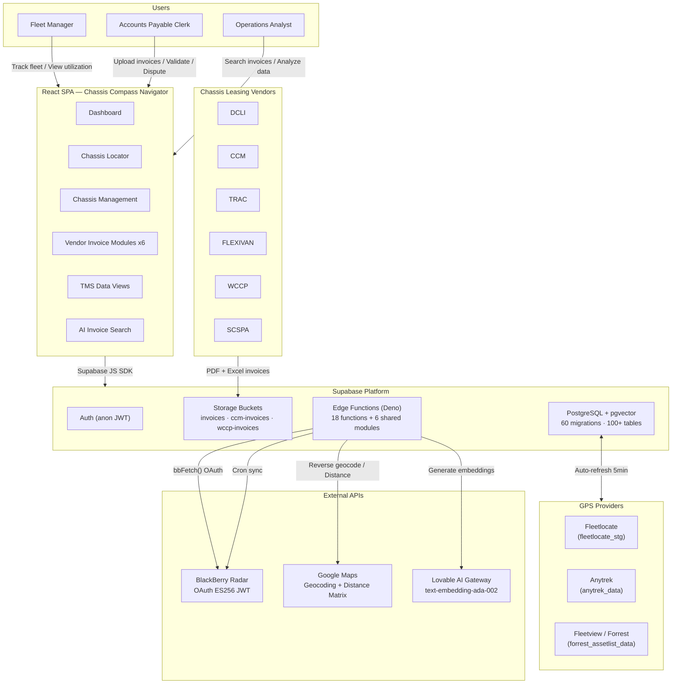
```mermaid
graph TB
    subgraph Users["Users"]
        FM["Fleet Manager"]
        AP["Accounts Payable Clerk"]
        OA["Operations Analyst"]
    end

    subgraph SPA["React SPA — Chassis Compass Navigator"]
        DASH["Dashboard"]
        CLOC["Chassis Locator"]
        CMGMT["Chassis Management"]
        VINV["Vendor Invoice Modules x6"]
        TMS_UI["TMS Data Views"]
        CHAT["AI Invoice Search"]
    end

    subgraph Supabase["Supabase Platform"]
        AUTH["Auth (anon JWT)"]
        STOR["Storage Buckets<br/>invoices · ccm-invoices · wccp-invoices"]
        DB["PostgreSQL + pgvector<br/>60 migrations · 100+ tables"]
        EF["Edge Functions (Deno)<br/>18 functions + 6 shared modules"]
    end

    subgraph GPS["GPS Providers"]
        FL["Fleetlocate<br/>(fleetlocate_stg)"]
        AT["Anytrek<br/>(anytrek_data)"]
        FV["Fleetview / Forrest<br/>(forrest_assetlist_data)"]
    end

    subgraph External["External APIs"]
        BB["BlackBerry Radar<br/>OAuth ES256 JWT"]
        GMAP["Google Maps<br/>Geocoding + Distance Matrix"]
        LAI["Lovable AI Gateway<br/>text-embedding-ada-002"]
    end

    subgraph Vendors["Chassis Leasing Vendors"]
        DCLI_V["DCLI"]
        CCM_V["CCM"]
        TRAC_V["TRAC"]
        FLEX_V["FLEXIVAN"]
        WCCP_V["WCCP"]
        SCSPA_V["SCSPA"]
    end

    FM -->|"Track fleet / View utilization"| SPA
    AP -->|"Upload invoices / Validate / Dispute"| SPA
    OA -->|"Search invoices / Analyze data"| SPA

    SPA -->|"Supabase JS SDK"| Supabase
    EF -->|"bbFetch() OAuth"| BB
    EF -->|"Reverse geocode / Distance"| GMAP
    EF -->|"Generate embeddings"| LAI

    DB <-->|"Auto-refresh 5min"| GPS
    EF -->|"Cron sync"| BB

    Vendors -->|"PDF + Excel invoices"| STOR
```

### Business Reasoning

**Who uses this system?** Three primary personas:
1. **Fleet Managers** — need real-time visibility into where their chassis are, which are idle, and utilization trends to optimize asset deployment.
2. **Accounts Payable Clerks** — receive invoices from 6 different chassis leasing vendors and must validate charges against actual shipment records before payment.
3. **Operations Analysts** — need to search across invoice history, analyze billing patterns, and identify overbilling or underutilization.

**What problem does it solve?** In drayage (short-haul container trucking), trucking companies lease chassis from multiple vendors. Each vendor sends invoices in different formats. Without a unified system, the company has no way to:
- Know where all chassis are in real time (GPS data is fragmented across providers)
- Verify that vendor charges match actual usage (days out, pickup/return dates)
- Catch overbilling, duplicate charges, or billing for idle periods
- Track utilization to make lease renewal decisions

**Why "Chassis Compass"?** The system acts as a compass for chassis management — providing direction on where assets are, what they cost, and whether the company is getting value from each lease.

---

## SECTION 2: GPS Data Unification Pipeline

### 2.1 Sequence Diagram — GPS Data Flow

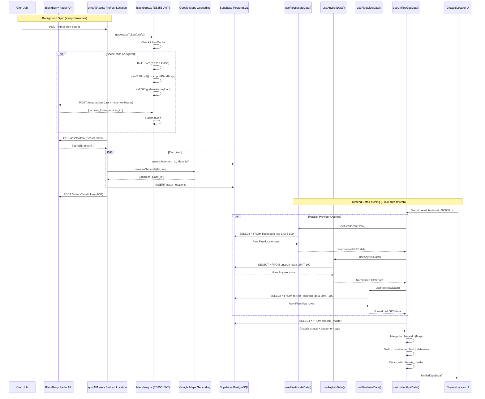
```mermaid
sequenceDiagram
    participant Cron as Cron Job
    participant BB_API as BlackBerry Radar API
    participant Sync as syncAllAssets / refreshLocation
    participant OAuth as blackberry.ts (ES256 JWT)
    participant Geo as Google Maps Geocoding
    participant DB as Supabase PostgreSQL
    participant FL_Hook as useFleetlocateData()
    participant AT_Hook as useAnytrekData()
    participant FV_Hook as useFleetviewData()
    participant Unified as useUnifiedGpsData()
    participant UI as ChassisLocator UI

    Note over Cron,Sync: Background Sync (every N minutes)
    Cron->>Sync: POST with x-cron-secret
    Sync->>OAuth: getAccessToken(prefix)
    OAuth->>OAuth: Check tokenCache
    alt Cache miss or expired
        OAuth->>OAuth: Build JWT (ES256 P-256)
        OAuth->>OAuth: pemToPkcs8() → importPkcs8Key()
        OAuth->>OAuth: es256Sign(header.payload)
        OAuth->>BB_API: POST /oauth/token (grant_type=jwt-bearer)
        BB_API-->>OAuth: { access_token, expires_in }
        OAuth->>OAuth: Cache token
    end
    Sync->>BB_API: GET /assets/data (Bearer token)
    BB_API-->>Sync: { items[], token[] }
    loop Each item
        Sync->>DB: ensureAsset(org_id, identifier)
        Sync->>Geo: reverseGeocode(lat, lon)
        Geo-->>Sync: { address, place_id }
        Sync->>DB: INSERT asset_locations
    end
    Sync->>BB_API: POST /assets/data/token (ACK)

    Note over FL_Hook,UI: Frontend Data Fetching (5-min auto-refresh)
    UI->>Unified: Mount / refetchInterval: 300000ms
    par Parallel Provider Queries
        Unified->>FL_Hook: useFleetlocateData()
        FL_Hook->>DB: SELECT * FROM fleetlocate_stg LIMIT 100
        DB-->>FL_Hook: Raw Fleetlocate rows
        FL_Hook-->>Unified: Normalized GPS data

        Unified->>AT_Hook: useAnytrekData()
        AT_Hook->>DB: SELECT * FROM anytrek_data LIMIT 100
        DB-->>AT_Hook: Raw Anytrek rows
        AT_Hook-->>Unified: Normalized GPS data

        Unified->>FV_Hook: useFleetviewData()
        FV_Hook->>DB: SELECT * FROM forrest_assetlist_data LIMIT 100
        DB-->>FV_Hook: Raw Fleetview rows
        FV_Hook-->>Unified: Normalized GPS data
    end

    Unified->>DB: SELECT * FROM chassis_master
    DB-->>Unified: Chassis status + equipment type

    Unified->>Unified: Merge by chassisId (Map)
    Unified->>Unified: Dedup: most recent lastUpdate wins
    Unified->>Unified: Enrich with chassis_master
    Unified-->>UI: UnifiedGpsData[]
```

### 2.2 GPS Entity-Relationship Diagram

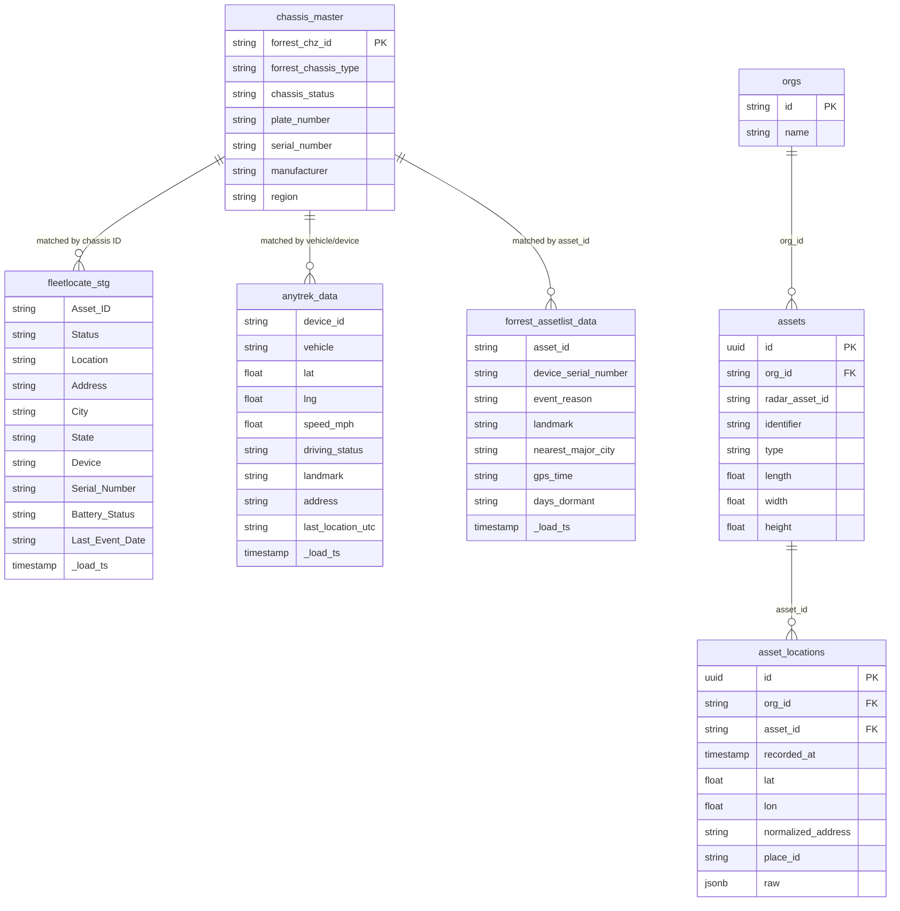
```mermaid
erDiagram
    chassis_master {
        string forrest_chz_id PK
        string forrest_chassis_type
        string chassis_status
        string plate_number
        string serial_number
        string manufacturer
        string region
    }

    fleetlocate_stg {
        string Asset_ID
        string Status
        string Location
        string Address
        string City
        string State
        string Device
        string Serial_Number
        string Battery_Status
        string Last_Event_Date
        timestamp _load_ts
    }

    anytrek_data {
        string device_id
        string vehicle
        float lat
        float lng
        float speed_mph
        string driving_status
        string landmark
        string address
        string last_location_utc
        timestamp _load_ts
    }

    forrest_assetlist_data {
        string asset_id
        string device_serial_number
        string event_reason
        string landmark
        string nearest_major_city
        string gps_time
        string days_dormant
        timestamp _load_ts
    }

    assets {
        uuid id PK
        string org_id FK
        string radar_asset_id
        string identifier
        string type
        float length
        float width
        float height
    }

    asset_locations {
        uuid id PK
        string org_id FK
        string asset_id FK
        timestamp recorded_at
        float lat
        float lon
        string normalized_address
        string place_id
        jsonb raw
    }

    orgs {
        string id PK
        string name
    }

    chassis_master ||--o{ fleetlocate_stg : "matched by chassis ID"
    chassis_master ||--o{ anytrek_data : "matched by vehicle/device"
    chassis_master ||--o{ forrest_assetlist_data : "matched by asset_id"
    orgs ||--o{ assets : "org_id"
    assets ||--o{ asset_locations : "asset_id"
```

### 2.3 Data Transformation Table

| Unified Field | Fleetlocate Source | Anytrek Source | Fleetview Source |
|---|---|---|---|
| `chassisId` | `normalizeChassisId(Asset ID)` | `normalizeChassisId(vehicle)` | `normalizeChassisId(asset_id)` |
| `latitude` | `0` (not available) | `Number(lat)` | `0` (not available) |
| `longitude` | `0` (not available) | `Number(lng)` | `0` (not available) |
| `speed` | `Duration` (misnamed) | `Number(speed_mph)` | `0` (not available) |
| `location` | `[Address, City, State].join(', ')` | `landmark ?? address` | `landmark ?? nearest_major_city` |
| `timestamp` | `Last Event Date` | `last_location_utc` | `gps_time ?? report_time` |
| `lastUpdate` | `_load_ts` | `_load_ts` | `_load_ts` |
| `provider` | `"Fleetlocate"` (hardcoded) | `"Anytrek"` (hardcoded) | `"Fleetview"` (hardcoded) |
| `notes` | `"Status: {Status}, Battery: {Battery}"` | `"Speed: {mph}, Direction: {dir}"` | `"Days dormant: {n}"` |

*Source: `src/hooks/useFleetlocateData.ts:51-64`, `src/hooks/useAnytrekData.ts:56-74`, `src/hooks/useFleetviewData.ts:52-70`*

### Business Reasoning

**Why aggregate from 3+ GPS providers instead of standardizing on one?**
Chassis are leased from multiple vendors, each of whom may install their own GPS devices. The trucking company doesn't control which provider tracks each chassis. Fleetlocate may track DCLI chassis, Anytrek may track privately-owned units, and Fleetview covers the Forrest fleet. Standardizing would require renegotiating every lease agreement — aggregation is the pragmatic solution.

**What does the 5-minute auto-refresh accomplish operationally?**
Fleet managers need near-real-time visibility to make dispatch decisions. A 5-minute refresh balances operational need against API/database load. If a chassis was just returned to a yard, the fleet manager needs to see it available within minutes — not hours.

**How does deduplication work?**
The merge uses a `Map<chassisId, UnifiedGpsData>` where the **most recent `lastUpdate` timestamp wins** (`src/hooks/useUnifiedGpsData.ts:65`). This ensures that if the same chassis appears in multiple providers (e.g., during a device swap), the freshest data is shown.

**What is BlackBerry Radar's role vs. the other GPS providers?**
BlackBerry Radar is a premium IoT tracking platform that provides asset-level telemetry (not just GPS). The `syncAllAssets` and `refreshLocation` cron functions pull data from Radar's streaming API, geocode the coordinates, and store structured location records in `asset_locations`. The other providers (Fleetlocate, Anytrek, Fleetview) are queried client-side from pre-ingested staging tables.

---

## SECTION 3: Invoice Ingestion & Extraction Pipeline

### 3.1 Invoice Lifecycle Flowchart

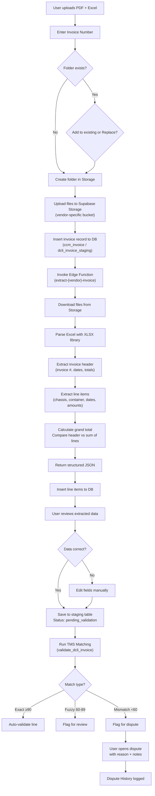
```mermaid
flowchart TD
    A["User uploads PDF + Excel"] --> B["Enter Invoice Number"]
    B --> C{"Folder exists?"}
    C -->|No| D["Create folder in Storage"]
    C -->|Yes| E{"Add to existing or Replace?"}
    E --> D
    D --> F["Upload files to Supabase Storage<br/>(vendor-specific bucket)"]
    F --> G["Insert invoice record to DB<br/>(ccm_invoice / dcli_invoice_staging)"]
    G --> H["Invoke Edge Function<br/>(extract-{vendor}-invoice)"]
    H --> I["Download files from Storage"]
    I --> J["Parse Excel with XLSX library"]
    J --> K["Extract invoice header<br/>(invoice #, dates, totals)"]
    K --> L["Extract line items<br/>(chassis, container, dates, amounts)"]
    L --> M["Calculate grand total<br/>Compare header vs sum of lines"]
    M --> N["Return structured JSON"]
    N --> O["Insert line items to DB"]
    O --> P["User reviews extracted data"]
    P --> Q{"Data correct?"}
    Q -->|Yes| R["Save to staging table<br/>Status: pending_validation"]
    Q -->|No| S["Edit fields manually"]
    S --> R
    R --> T["Run TMS Matching<br/>(validate_dcli_invoice)"]
    T --> U{"Match type?"}
    U -->|Exact ≥90| V["Auto-validate line"]
    U -->|Fuzzy 60-89| W["Flag for review"]
    U -->|Mismatch <60| X["Flag for dispute"]
    X --> Y["User opens dispute<br/>with reason + notes"]
    Y --> Z["Dispute History logged"]
```

### 3.2 DCLI Invoice Extraction Sequence

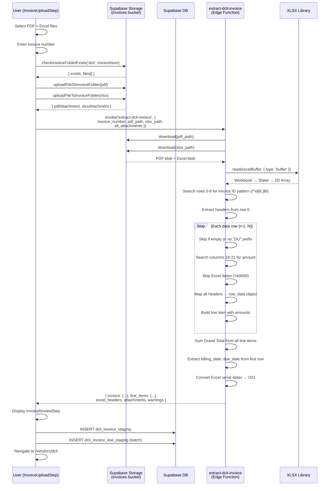
```mermaid
sequenceDiagram
    participant User as User (InvoiceUploadStep)
    participant Storage as Supabase Storage<br/>(invoices bucket)
    participant DB as Supabase DB
    participant EF as extract-dcli-invoice<br/>(Edge Function)
    participant XLSX as XLSX Library

    User->>User: Select PDF + Excel files
    User->>User: Enter invoice number
    User->>Storage: checkInvoiceFolderExists('dcli', invoiceNum)
    Storage-->>User: { exists, files[] }

    User->>Storage: uploadFileToInvoiceFolder(pdf)
    User->>Storage: uploadFileToInvoiceFolder(xlsx)
    Storage-->>User: [ pdfAttachment, xlsxAttachment ]

    User->>EF: invoke('extract-dcli-invoice', {<br/>  invoice_number, pdf_path, xlsx_path,<br/>  all_attachments })

    EF->>Storage: download(pdf_path)
    EF->>Storage: download(xlsx_path)
    Storage-->>EF: PDF blob + Excel blob

    EF->>XLSX: read(excelBuffer, { type: 'buffer' })
    XLSX-->>EF: Workbook → Sheet → 2D Array

    EF->>EF: Search rows 0-9 for invoice ID pattern (/^\d{6,}$/)
    EF->>EF: Extract headers from row 0

    loop Each data row (i=1..N)
        EF->>EF: Skip if empty or no "DU" prefix
        EF->>EF: Search columns 18-21 for amount
        EF->>EF: Skip Excel dates (>40000)
        EF->>EF: Map all headers → row_data object
        EF->>EF: Build line item with amounts
    end

    EF->>EF: Sum Grand Total from all line items
    EF->>EF: Extract billing_date, due_date from first row
    EF->>EF: Convert Excel serial dates → ISO

    EF-->>User: { invoice: {...}, line_items: [...],<br/>  excel_headers, attachments, warnings }

    User->>User: Display InvoiceReviewStep
    User->>DB: INSERT dcli_invoice_staging
    User->>DB: INSERT dcli_invoice_line_staging (batch)
    User->>User: Navigate to /vendors/dcli
```

### 3.3 Vendor Extractor Comparison

| Feature | DCLI | CCM | TRAC | WCCP | FLEXIVAN | SCSPA | AI-Based (extract_invoice_data) |
|---|---|---|---|---|---|---|---|
| **File Formats** | PDF + Excel | PDF + Excel | PDF + Excel | PDF + Excel | PDF + Excel | PDF + Excel | PDF + CSV |
| **PDF Parsing** | No | No | Yes (date regex) | Yes (amount/date regex) | No | No | Yes (AI extraction) |
| **Excel Column Detection** | Fixed (cols 18-21) | Flexible header search | Flexible header search | Fixed position (cols 0-4) | Flexible header search | Flexible header search | AI-mapped |
| **Amount Headers** | Tier 1 Subtotal region | Amount, Total, Charge | Amount, Total, Charge | PDF regex: Amount Due | Amount, Total, Outstanding Balance | Amount, Total, Charge | AI: col[15] |
| **Date Handling** | Excel serial → ISO | Not parsed | 3 regex patterns (DD-MMM-YY, MM/DD/YYYY, YYYY-MM-DD) | PDF regex + auto-calc ±30 days | Not parsed | Not parsed | AI parsing |
| **Line Item Fields** | Full (13 fields) | Basic (3 fields) | Basic (3 fields) | Full (12 fields) | Basic (3 fields) | Basic (3 fields) | Full (7 fields) |
| **Validation** | Grand Total check | None | None | Line sum check | None | None | Header vs line sum + count |
| **AI Model** | None | None | None | None | None | None | gemini-2.5-flash via Lovable |
| **Storage Bucket** | invoices | ccm-invoices | (same as CCM pattern) | wccp-invoices | flexivan-invoices | scspa-invoices | wccp-invoices |
| **Status** | Complete | Partial | Complete | Complete | Partial | Partial | Complete |

*Sources: `supabase/functions/extract-dcli-invoice/index.ts`, `extract-ccm-invoice/index.ts`, `extract-trac-invoice/index.ts`, `extract-wccp-invoice/index.ts`, `extract-flexivan-invoice/index.ts`, `extract-scspa-invoice/index.ts`, `extract_invoice_data/index.ts`*

### Business Reasoning

**Why 6 different chassis leasing vendors?** In the US drayage industry, no single company owns enough chassis to serve all ports and routes. Trucking companies lease chassis from multiple pool operators (DCLI at West Coast ports, TRAC at East Coast, FLEXIVAN for intermodal, etc.). Each vendor has its own billing system and invoice format.

**What is the vendor-trucker relationship?** The trucking company picks up a chassis from a vendor's pool at a port/rail terminal, uses it to haul a container, then returns it. The vendor bills per-day for the time the chassis is out. Invoices can cover hundreds of chassis movements per billing cycle.

**Why extract from PDFs/Excel instead of structured data?** These vendors don't offer APIs. They email PDF invoices and Excel detail sheets — some with 20+ column spreadsheets in proprietary formats. The extraction pipeline must reverse-engineer each vendor's format.

**What does the dispute workflow accomplish?** When a line item doesn't match TMS records (wrong dates, extra days billed, chassis not used), the AP clerk can dispute it with documented reasons. This creates an audit trail for vendor negotiations and can recover 1-5% of total invoice value.

---

## SECTION 4: Invoice Validation & TMS Matching

### 4.1 TMS Data Flow

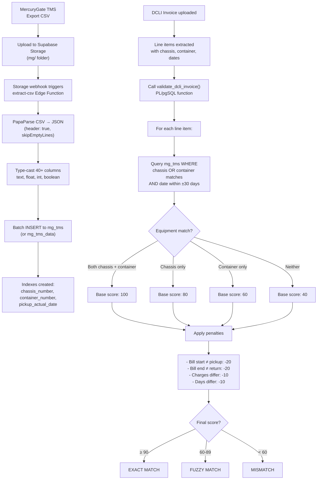
```mermaid
flowchart TD
    A["MercuryGate TMS<br/>Export CSV"] --> B["Upload to Supabase Storage<br/>(mg/ folder)"]
    B --> C["Storage webhook triggers<br/>extract-csv Edge Function"]
    C --> D["PapaParse CSV → JSON<br/>(header: true, skipEmptyLines)"]
    D --> E["Type-cast 40+ columns<br/>text, float, int, boolean"]
    E --> F["Batch INSERT to mg_tms<br/>(or mg_tms_data)"]
    F --> G["Indexes created:<br/>chassis_number, container_number,<br/>pickup_actual_date"]

    H["DCLI Invoice uploaded"] --> I["Line items extracted<br/>with chassis, container, dates"]
    I --> J["Call validate_dcli_invoice()<br/>PL/pgSQL function"]
    J --> K["For each line item:"]
    K --> L["Query mg_tms WHERE<br/>chassis OR container matches<br/>AND date within ±30 days"]
    L --> M{"Equipment match?"}
    M -->|Both chassis + container| N["Base score: 100"]
    M -->|Chassis only| O["Base score: 80"]
    M -->|Container only| P["Base score: 60"]
    M -->|Neither| Q["Base score: 40"]
    N --> R["Apply penalties"]
    O --> R
    P --> R
    Q --> R
    R --> S["- Bill start ≠ pickup: -20<br/>- Bill end ≠ return: -20<br/>- Charges differ: -10<br/>- Days differ: -10"]
    S --> T{"Final score?"}
    T -->|"≥ 90"| U["EXACT MATCH"]
    T -->|"60-89"| V["FUZZY MATCH"]
    T -->|"< 60"| W["MISMATCH"]
```

### 4.2 Confidence Scoring Decision Tree

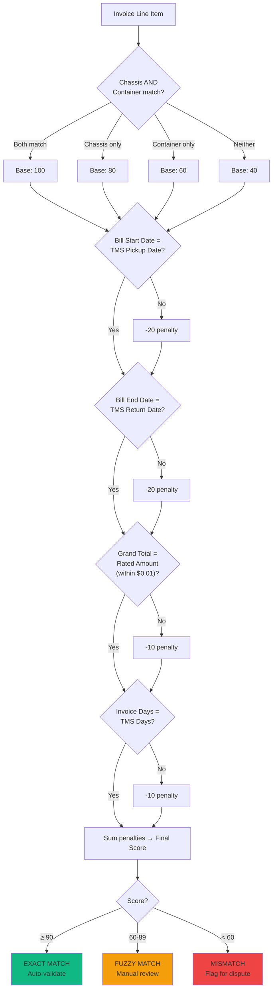
```mermaid
flowchart TD
    START["Invoice Line Item"] --> CHECK_EQUIP{"Chassis AND<br/>Container match?"}

    CHECK_EQUIP -->|Both match| SCORE_100["Base: 100"]
    CHECK_EQUIP -->|Chassis only| SCORE_80["Base: 80"]
    CHECK_EQUIP -->|Container only| SCORE_60["Base: 60"]
    CHECK_EQUIP -->|Neither| SCORE_40["Base: 40"]

    SCORE_100 --> CHECK_DATES
    SCORE_80 --> CHECK_DATES
    SCORE_60 --> CHECK_DATES
    SCORE_40 --> CHECK_DATES

    CHECK_DATES{"Bill Start Date =<br/>TMS Pickup Date?"}
    CHECK_DATES -->|Yes| CHECK_END
    CHECK_DATES -->|No| PEN_START["-20 penalty"]
    PEN_START --> CHECK_END

    CHECK_END{"Bill End Date =<br/>TMS Return Date?"}
    CHECK_END -->|Yes| CHECK_AMT
    CHECK_END -->|No| PEN_END["-20 penalty"]
    PEN_END --> CHECK_AMT

    CHECK_AMT{"Grand Total =<br/>Rated Amount<br/>(within $0.01)?"}
    CHECK_AMT -->|Yes| CHECK_DAYS
    CHECK_AMT -->|No| PEN_AMT["-10 penalty"]
    PEN_AMT --> CHECK_DAYS

    CHECK_DAYS{"Invoice Days =<br/>TMS Days?"}
    CHECK_DAYS -->|Yes| FINAL
    CHECK_DAYS -->|No| PEN_DAYS["-10 penalty"]
    PEN_DAYS --> FINAL

    FINAL["Sum penalties → Final Score"]
    FINAL --> CLASSIFY{"Score?"}
    CLASSIFY -->|"≥ 90"| EXACT["EXACT MATCH<br/>Auto-validate"]
    CLASSIFY -->|"60-89"| FUZZY["FUZZY MATCH<br/>Manual review"]
    CLASSIFY -->|"< 60"| MISMATCH["MISMATCH<br/>Flag for dispute"]

    style EXACT fill:#10b981
    style FUZZY fill:#f59e0b
    style MISMATCH fill:#ef4444
```

*Source: `supabase/migrations/20251021011703_*.sql` — `validate_dcli_invoice()` function, lines 101-220*

### 4.3 Fields Compared

| Invoice Field (from line_item row_data) | TMS Field (mg_tms) | Comparison Method |
|---|---|---|
| `Chassis` or `chassis_out` | `chassis_number` | `LOWER(TRIM(...))` equality |
| `On-Hire Container` or `container_out` | `container_number` | `LOWER(TRIM(...))` equality |
| `Bill Start Date` | `pickup_actual_date` | Date equality |
| `Bill End Date` | `actual_rc_date` | Date equality |
| `Grand Total` | `rated_amount` | Numeric within $0.01 |
| `(Tier 1/2/3 Days - Free Days)` sum | `invoice_quantity` or `rated_quantity` | Integer equality |

### Business Reasoning

**What is a TMS?** A Transportation Management System (like MercuryGate) is the trucking company's operational record of every load — when a container was picked up, which chassis was used, when it was delivered, and when the empty was returned. It is the **source of truth** for actual chassis usage.

**Why cross-reference invoices against TMS?** Vendor invoices may charge for:
- More days than the chassis was actually out (extra per-diem)
- Chassis that were already returned (billing after return date)
- Containers that were never on that chassis
- Duplicate charges for the same movement

Cross-referencing catches these by comparing what the vendor billed vs. what actually happened.

**What billing errors does this catch?**
- **Date inflation:** Vendor bills 15 days but TMS shows 12 days out → saves 3 days × $35/day = $105 per line
- **Ghost chassis:** Invoice lists chassis not in TMS → entire line is invalid
- **Return date mismatch:** Vendor hasn't processed return → still billing for returned equipment

**How does utilization help?** If a chassis is idle 60% of the time, the lease cost per productive day doubles. Fleet managers use utilization data to decide whether to return underused chassis, negotiate lower rates, or redistribute assets between yards.

---

## SECTION 5: AI-Powered Semantic Search

### 5.1 Embedding & Search Sequence

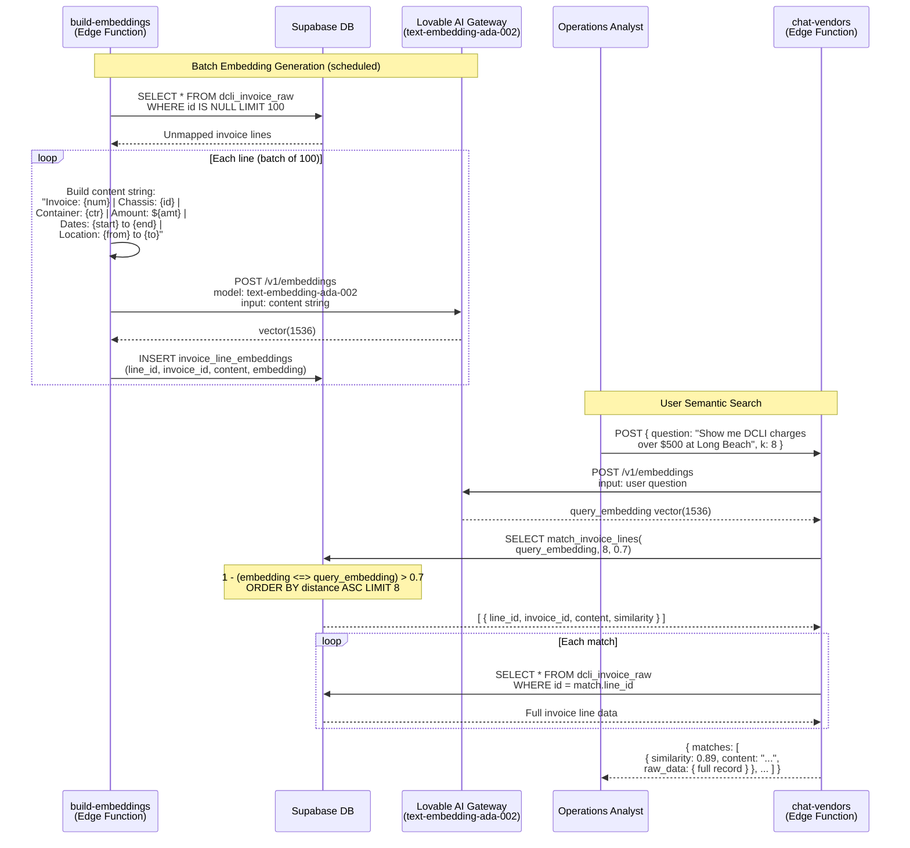
```mermaid
sequenceDiagram
    participant Batch as build-embeddings<br/>(Edge Function)
    participant DB as Supabase DB
    participant AI as Lovable AI Gateway<br/>(text-embedding-ada-002)
    participant User as Operations Analyst
    participant Chat as chat-vendors<br/>(Edge Function)

    Note over Batch,AI: Batch Embedding Generation (scheduled)
    Batch->>DB: SELECT * FROM dcli_invoice_raw<br/>WHERE id IS NULL LIMIT 100
    DB-->>Batch: Unmapped invoice lines

    loop Each line (batch of 100)
        Batch->>Batch: Build content string:<br/>"Invoice: {num} | Chassis: {id} |<br/>Container: {ctr} | Amount: ${amt} |<br/>Dates: {start} to {end} |<br/>Location: {from} to {to}"
        Batch->>AI: POST /v1/embeddings<br/>model: text-embedding-ada-002<br/>input: content string
        AI-->>Batch: vector(1536)
        Batch->>DB: INSERT invoice_line_embeddings<br/>(line_id, invoice_id, content, embedding)
    end

    Note over User,Chat: User Semantic Search
    User->>Chat: POST { question: "Show me DCLI charges<br/>over $500 at Long Beach", k: 8 }
    Chat->>AI: POST /v1/embeddings<br/>input: user question
    AI-->>Chat: query_embedding vector(1536)
    Chat->>DB: SELECT match_invoice_lines(<br/>  query_embedding, 8, 0.7)
    Note over DB: 1 - (embedding <=> query_embedding) > 0.7<br/>ORDER BY distance ASC LIMIT 8
    DB-->>Chat: [ { line_id, invoice_id, content, similarity } ]

    loop Each match
        Chat->>DB: SELECT * FROM dcli_invoice_raw<br/>WHERE id = match.line_id
        DB-->>Chat: Full invoice line data
    end

    Chat-->>User: { matches: [<br/>  { similarity: 0.89, content: "...",<br/>    raw_data: { full record } }, ... ] }
```

### 5.2 Architecture Diagram

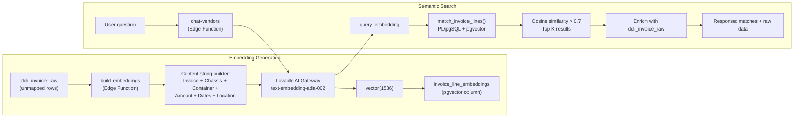
```mermaid
graph LR
    subgraph "Embedding Generation"
        A["dcli_invoice_raw<br/>(unmapped rows)"] --> B["build-embeddings<br/>(Edge Function)"]
        B --> C["Content string builder:<br/>Invoice + Chassis + Container +<br/>Amount + Dates + Location"]
        C --> D["Lovable AI Gateway<br/>text-embedding-ada-002"]
        D --> E["vector(1536)"]
        E --> F["invoice_line_embeddings<br/>(pgvector column)"]
    end

    subgraph "Semantic Search"
        G["User question"] --> H["chat-vendors<br/>(Edge Function)"]
        H --> D
        D --> I["query_embedding"]
        I --> J["match_invoice_lines()<br/>PL/pgSQL + pgvector"]
        J --> K["Cosine similarity > 0.7<br/>Top K results"]
        K --> L["Enrich with dcli_invoice_raw"]
        L --> M["Response: matches + raw data"]
    end
```

### Business Reasoning

**Why semantic search instead of text search?** Invoice data is semi-structured — "DCLI charges at Long Beach port" should match records with "LGB" location codes, "DCLI" vendor, and varying amount fields. Semantic embeddings understand meaning, not just keywords. A text search for "Long Beach" would miss "LGB" and "POLA."

**What questions would users ask?**
- "Find all DCLI charges over $500 in October"
- "Which chassis had the longest billing periods?"
- "Show me invoices where container was MSCU7654321"
- "What were the total charges at Port of Long Beach last quarter?"

**How does the 0.7 threshold affect results?** At 0.7, only results with 70%+ semantic similarity are returned. This filters out irrelevant matches while still capturing relevant records that use different terminology. Lowering to 0.5 would return more results but with more noise; raising to 0.9 would be too restrictive for natural language queries.

---

## SECTION 6: Asset Management & Geofencing

### 6.1 Asset Creation/Sync Sequence

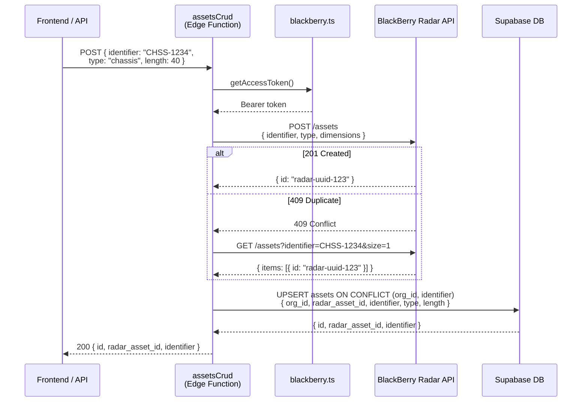
```mermaid
sequenceDiagram
    participant Client as Frontend / API
    participant CRUD as assetsCrud<br/>(Edge Function)
    participant OAuth as blackberry.ts
    participant Radar as BlackBerry Radar API
    participant DB as Supabase DB

    Client->>CRUD: POST { identifier: "CHSS-1234",<br/>type: "chassis", length: 40 }

    CRUD->>OAuth: getAccessToken()
    OAuth-->>CRUD: Bearer token

    CRUD->>Radar: POST /assets<br/>{ identifier, type, dimensions }
    alt 201 Created
        Radar-->>CRUD: { id: "radar-uuid-123" }
    else 409 Duplicate
        Radar-->>CRUD: 409 Conflict
        CRUD->>Radar: GET /assets?identifier=CHSS-1234&size=1
        Radar-->>CRUD: { items: [{ id: "radar-uuid-123" }] }
    end

    CRUD->>DB: UPSERT assets ON CONFLICT (org_id, identifier)<br/>{ org_id, radar_asset_id, identifier, type, length }
    DB-->>CRUD: { id, radar_asset_id, identifier }
    CRUD-->>Client: 200 { id, radar_asset_id, identifier }
```

### 6.2 Geofence Lifecycle

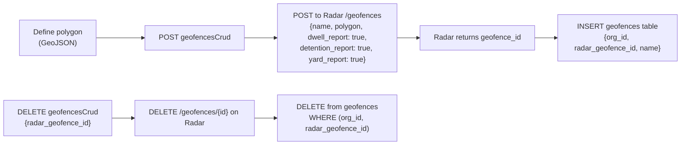
```mermaid
flowchart LR
    A["Define polygon<br/>(GeoJSON)"] --> B["POST geofencesCrud"]
    B --> C["POST to Radar /geofences<br/>{name, polygon, dwell_report: true,<br/>detention_report: true, yard_report: true}"]
    C --> D["Radar returns geofence_id"]
    D --> E["INSERT geofences table<br/>{org_id, radar_geofence_id, name}"]

    F["DELETE geofencesCrud<br/>{radar_geofence_id}"] --> G["DELETE /geofences/{id} on Radar"]
    G --> H["DELETE from geofences<br/>WHERE (org_id, radar_geofence_id)"]
```

### 6.3 Distance Calculation

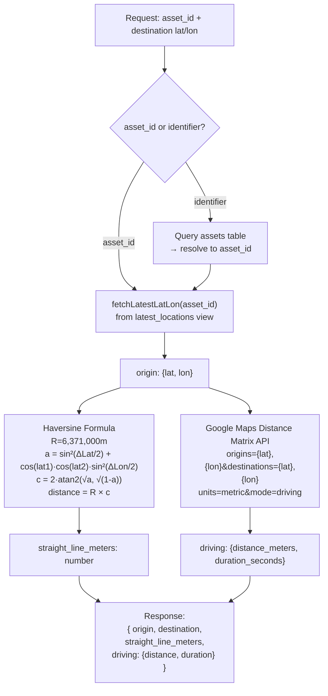
```mermaid
flowchart TD
    A["Request: asset_id + destination lat/lon"] --> B{"asset_id or identifier?"}
    B -->|identifier| C["Query assets table<br/>→ resolve to asset_id"]
    B -->|asset_id| D["fetchLatestLatLon(asset_id)<br/>from latest_locations view"]
    C --> D
    D --> E["origin: {lat, lon}"]

    E --> F["Haversine Formula<br/>R=6,371,000m<br/>a = sin²(ΔLat/2) + cos(lat1)·cos(lat2)·sin²(ΔLon/2)<br/>c = 2·atan2(√a, √(1-a))<br/>distance = R × c"]
    F --> G["straight_line_meters: number"]

    E --> H["Google Maps Distance Matrix API<br/>origins={lat},{lon}&destinations={lat},{lon}<br/>units=metric&mode=driving"]
    H --> I["driving: {distance_meters, duration_seconds}"]

    G --> J["Response:<br/>{ origin, destination,<br/>straight_line_meters,<br/>driving: {distance, duration} }"]
    I --> J
```

*Source: `supabase/functions/getDistance/index.ts:69-113`, `supabase/functions/_shared/db.ts:52-66`*

### Business Reasoning

**Why sync assets to BlackBerry Radar?** Radar provides enterprise-grade IoT tracking with cellular-connected sensors. By syncing the company's asset registry to Radar, every chassis gets a digital twin in Radar's platform, enabling automated alerts (e.g., chassis left a geofence, battery low, tampering detected).

**What are geofences used for?** In trucking operations, geofences define the perimeters of yards, ports, rail terminals, and customer sites. When a tracked chassis enters or exits a geofence, the system can:
- Automatically mark chassis as "returned" (exit port geofence)
- Calculate dwell time at customer locations (detention charges)
- Alert if chassis enters unauthorized areas

**Why both straight-line and driving distance?** Straight-line (Haversine) is instant and free — useful for rough proximity checks ("is the nearest available chassis within 50 miles?"). Driving distance is more accurate for dispatch decisions ("how long will it take to get chassis to the port?") but costs per API call.

---

## SECTION 7: Chassis Utilization Analytics

### 7.1 Utilization Calculation Algorithm

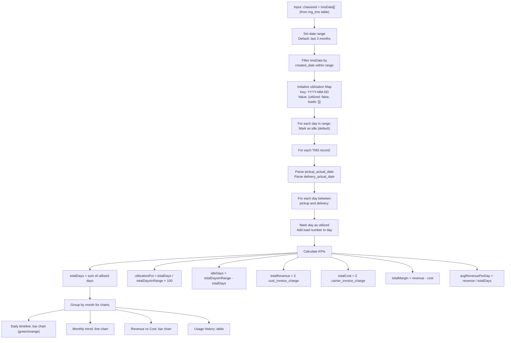
```mermaid
flowchart TD
    A["Input: chassisId + tmsData[]<br/>(from mg_tms table)"] --> B["Set date range<br/>Default: last 3 months"]
    B --> C["Filter tmsData by<br/>created_date within range"]
    C --> D["Initialize utilization Map<br/>Key: YYYY-MM-DD<br/>Value: {utilized: false, loads: []}"]

    D --> E["For each day in range:<br/>Mark as idle (default)"]

    E --> F["For each TMS record:"]
    F --> G["Parse pickup_actual_date<br/>Parse delivery_actual_date"]
    G --> H["For each day between<br/>pickup and delivery:"]
    H --> I["Mark day as utilized<br/>Add load number to day"]

    I --> J["Calculate KPIs"]
    J --> K["totalDays = sum of utilized days"]
    J --> L["utilizationPct = totalDays / totalDaysInRange × 100"]
    J --> M["idleDays = totalDaysInRange - totalDays"]
    J --> N["totalRevenue = Σ cust_invoice_charge"]
    J --> O["totalCost = Σ carrier_invoice_charge"]
    J --> P["totalMargin = revenue - cost"]
    J --> Q["avgRevenuePerDay = revenue / totalDays"]

    K --> R["Group by month for charts"]
    R --> S["Daily timeline: bar chart (green/orange)"]
    R --> T["Monthly trend: line chart"]
    R --> U["Revenue vs Cost: bar chart"]
    R --> V["Usage history: table"]
```

*Source: `src/components/chassis/UtilizationTab.tsx:116-270`*

### 7.2 Dashboard Wireframe

```
┌─────────────────────────────────────────────────────────────────────────────┐
│ Debug Information  [Show/Hide]                                              │
├─────────────────────────────────────────────────────────────────────────────┤
│ Date Range Filter     [From: Oct 25, 2025 ▼]  [To: Jan 25, 2026 ▼]  [Reset]│
├───────────┬───────────┬───────────┬───────────┬───────────┬─────────────────┤
│ Util. %   │Total Loads│ Days Used │ Idle Days │ Revenue   │ Avg Rev/Day    │
│  67.3%    │    42     │   62      │   30      │ $28,450   │  $458.87       │
│ 62/92 days│           │  (green)  │  (orange) │  (green)  │  (green)       │
├───────────┴───────────┴───────────┴───────────┴───────────┴─────────────────┤
│ Daily Utilization Timeline                                                   │
│ ████░░████████░░░████████████░░████████░░░░████████████████░░░░████          │
│ ■ Utilized  ■ Idle                              Oct → Nov → Dec → Jan       │
├─────────────────────────────────────────────────────────────────────────────┤
│ Monthly Utilization Trend                    │ Monthly Revenue vs Cost       │
│ ────── Revenue  ── Cost  ── Loads  ── Days   │ ███ Revenue  ███ Cost  ███ Margin│
│   /\                                         │                               │
│  /  \    /\                                  │  ███   ███   ███   ███        │
│ /    \  /  \                                 │  ███   ███   ███   ███        │
│/      \/    \                                │  ███   ███   ███   ███        │
│  Oct   Nov   Dec   Jan                       │  Oct   Nov   Dec   Jan        │
├─────────────────────────────────────────────────────────────────────────────┤
│ Revenue │ Cost    │ Margin                                                   │
│ $28,450 │ $18,200 │ $10,250 (36.0%)                                         │
├─────────────────────────────────────────────────────────────────────────────┤
│ Recent Usage History                                                         │
│ Date       │ Load #   │ Container   │ Customer    │ Days │ Rev    │ Cost   │ Margin│
│ Jan 15     │ LD-4521  │ MSCU765432  │ ABC Freight │  4   │ $1,200 │ $780   │ $420  │
│ Jan 10     │ LD-4498  │ TEMU123456  │ XYZ Drayage │  3   │ $890   │ $620   │ $270  │
│ ...        │ ...      │ ...         │ ...         │ ...  │ ...    │ ...    │ ...   │
└─────────────────────────────────────────────────────────────────────────────┘
```

### 7.3 Formula Documentation

| Metric | Formula | Source |
|---|---|---|
| **Utilization %** | `(totalDaysUsed / totalDaysInRange) × 100` | `UtilizationTab.tsx:185` |
| **Total Days Used** | `Σ max(differenceInDays(delivery, pickup), 0)` for all loads | `UtilizationTab.tsx:163` |
| **Idle Days** | `totalDaysInRange - totalDaysUsed` | `UtilizationTab.tsx:186` |
| **Total Revenue** | `Σ cust_invoice_charge` across filtered TMS records | `UtilizationTab.tsx:140` |
| **Total Cost** | `Σ carrier_invoice_charge` across filtered TMS records | `UtilizationTab.tsx:141` |
| **Total Margin** | `totalRevenue - totalCost` | `UtilizationTab.tsx:142` |
| **Margin %** | `(totalMargin / totalRevenue) × 100` | `UtilizationTab.tsx:143` |
| **Avg Revenue/Day** | `totalRevenue / totalDaysUsed` | `UtilizationTab.tsx:184` |

### Business Reasoning

**What does utilization % tell operations managers?** If a chassis has 45% utilization, it's idle more than half the time — meaning the company pays the daily lease rate for 55% of days without generating revenue. Managers use this to decide: return the chassis, move it to a busier yard, or negotiate a lower rate.

**Why track idle days?** Each idle day costs the daily lease rate ($25-$50/day) with zero revenue. For a fleet of 500 chassis, reducing idle time by 5% saves: 500 × 365 × 0.05 × $35 = **$319,375/year**.

**How does revenue-per-day inform leasing decisions?** If chassis A generates $450/day and chassis B generates $200/day, but both cost $35/day to lease, chassis A has 12.9x ROI vs. 5.7x for B. This helps decide which routes and chassis types to prioritize.

**Why default to 3 months?** Three months provides enough data to smooth seasonal fluctuations while remaining recent enough to reflect current operations. Shorter windows are noisy; longer windows dilute recent trends.

---

## SECTION 8: Frontend Navigation & User Journeys

### 8.1 Application Sitemap


```mermaid
graph TD
    ROOT["/ Dashboard"]
    ROOT --> CHASSIS["/chassis — Chassis Management"]
    CHASSIS --> CHASSIS_ID["/chassis/:id — Chassis Detail"]
    CHASSIS --> LOCATOR["/chassis/locator — Chassis Locator (Map)"]

    ROOT --> TMS["/tms — TMS Data"]
    TMS --> MG["/tms/mercury-gate — MercuryGate"]
    TMS --> PP["/tms/port-pro — PortPro"]

    ROOT --> YARDS["/yards — Yard Report Overview"]
    YARDS --> POLA["/yards/pola — POLA Yard"]
    YARDS --> JED["/yards/jed — JED Yard"]

    ROOT --> GPS["/gps — GPS Overview"]
    GPS --> SAMSARA["/gps/samsara"]
    GPS --> BBGPS["/gps/blackberry"]
    GPS --> FVIEW["/gps/fleetview"]
    GPS --> FLOC["/gps/fleetlocate"]
    GPS --> ATRK["/gps/anytrek"]

    ROOT --> VENDOR["/validation — Vendor Validation"]
    VENDOR --> DCLI["/vendors/dcli"]
    VENDOR --> CCM["/vendors/ccm"]
    VENDOR --> SCSPA["/vendors/scspa"]
    VENDOR --> WCCP["/vendors/wccp"]
    VENDOR --> TRAC["/vendors/trac"]
    VENDOR --> FLEX["/vendors/flexivan"]

    DCLI --> DCLI_NEW["/vendors/dcli/invoices/new"]
    DCLI --> DCLI_REV["/vendors/dcli/invoices/:id/review"]
    DCLI --> DCLI_DET["/vendors/dcli/invoices/:id/detail"]
    DCLI --> DCLI_LINE["/vendors/dcli/invoice-line/:id"]
    DCLI --> DCLI_DISP["/vendors/dcli/invoice-line/:id/dispute"]

    ROOT --> SETTINGS["/settings — Settings"]
    ROOT --> INVOICES["/invoices — Invoice List"]
```

*Source: `src/App.tsx:72-321` — 40+ route definitions*

### 8.2 User Journey: Fleet Manager — Check Location & Utilization

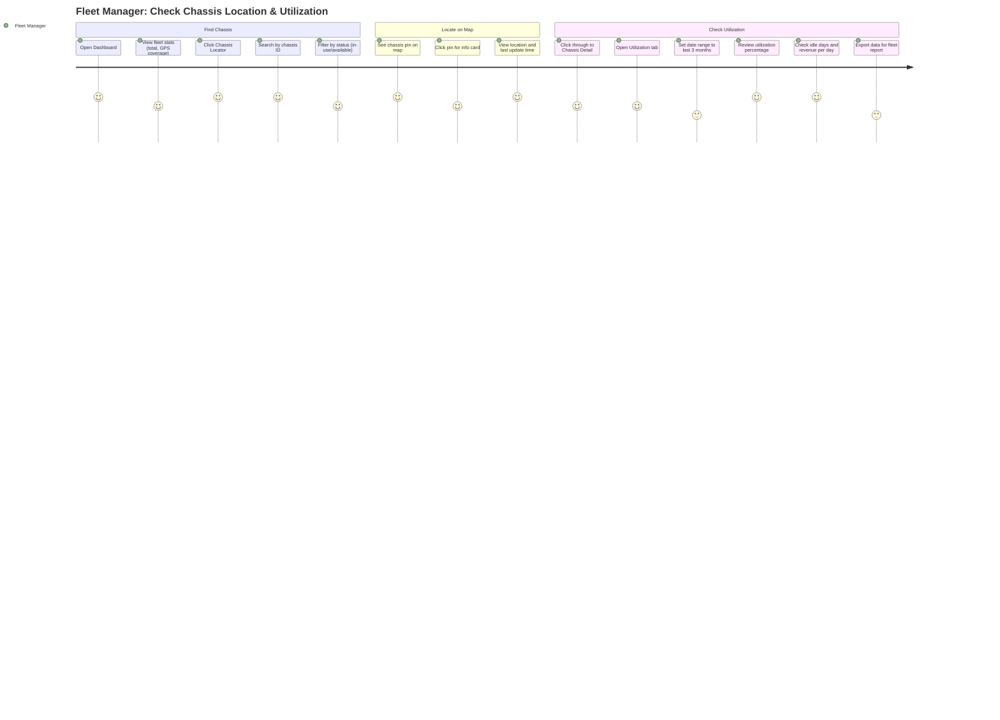
```mermaid
journey
    title Fleet Manager: Check Chassis Location & Utilization
    section Find Chassis
        Open Dashboard: 5: Fleet Manager
        View fleet stats (total, GPS coverage): 4: Fleet Manager
        Click Chassis Locator: 5: Fleet Manager
        Search by chassis ID: 5: Fleet Manager
        Filter by status (in-use/available): 4: Fleet Manager
    section Locate on Map
        See chassis pin on map: 5: Fleet Manager
        Click pin for info card: 4: Fleet Manager
        View location and last update time: 5: Fleet Manager
    section Check Utilization
        Click through to Chassis Detail: 4: Fleet Manager
        Open Utilization tab: 4: Fleet Manager
        Set date range to last 3 months: 3: Fleet Manager
        Review utilization percentage: 5: Fleet Manager
        Check idle days and revenue per day: 5: Fleet Manager
        Export data for fleet report: 3: Fleet Manager
```

### 8.3 User Journey: AP Clerk — Upload & Validate DCLI Invoice

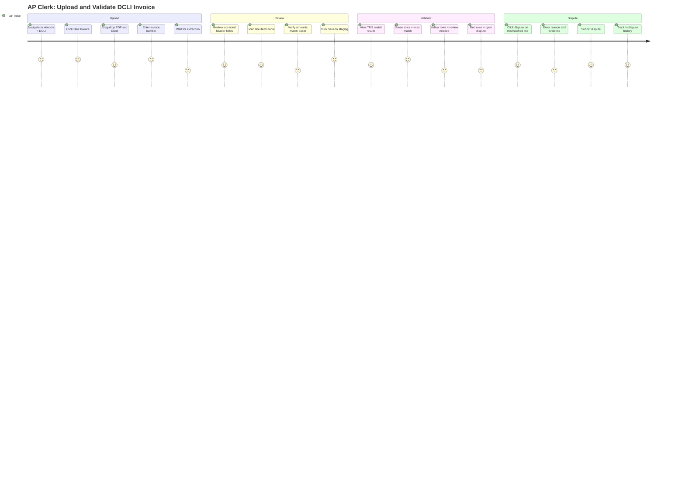
```mermaid
journey
    title AP Clerk: Upload and Validate DCLI Invoice
    section Upload
        Navigate to Vendors > DCLI: 5: AP Clerk
        Click New Invoice: 5: AP Clerk
        Drag-drop PDF and Excel: 4: AP Clerk
        Enter invoice number: 5: AP Clerk
        Wait for extraction: 3: AP Clerk
    section Review
        Review extracted header fields: 4: AP Clerk
        Scan line items table: 4: AP Clerk
        Verify amounts match Excel: 3: AP Clerk
        Click Save to staging: 5: AP Clerk
    section Validate
        View TMS match results: 4: AP Clerk
        Green rows = exact match: 5: AP Clerk
        Yellow rows = review needed: 3: AP Clerk
        Red rows = open dispute: 3: AP Clerk
    section Dispute
        Click dispute on mismatched line: 4: AP Clerk
        Enter reason and evidence: 3: AP Clerk
        Submit dispute: 4: AP Clerk
        Track in dispute history: 4: AP Clerk
```

### 8.4 User Journey: Analyst — AI Invoice Search

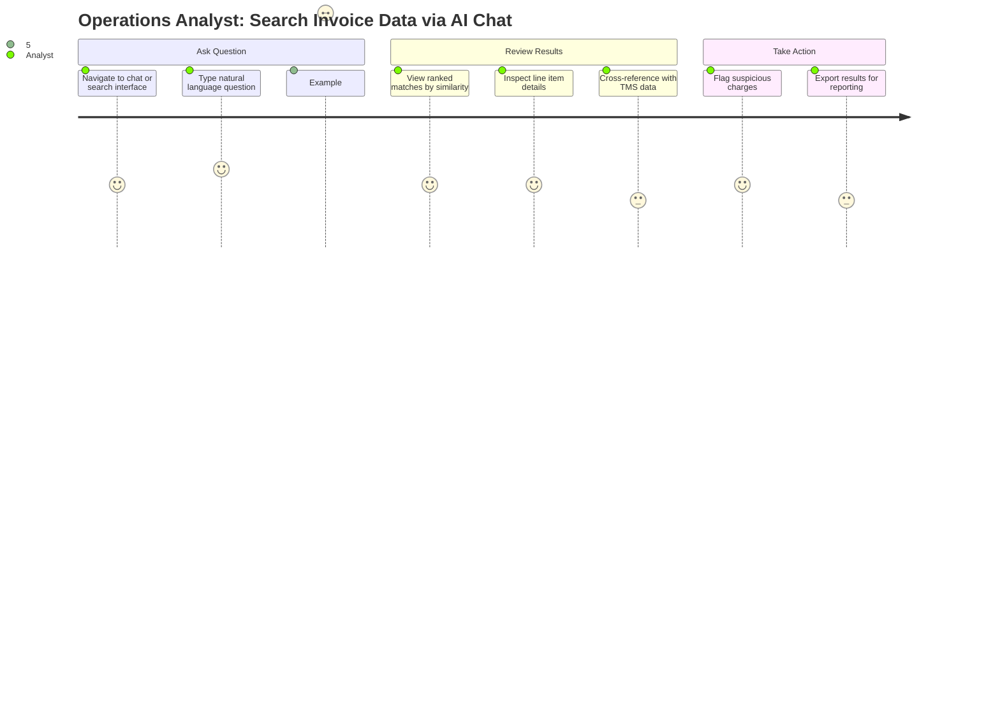
```mermaid
journey
    title Operations Analyst: Search Invoice Data via AI Chat
    section Ask Question
        Navigate to chat or search interface: 4: Analyst
        Type natural language question: 5: Analyst
        Example: Show DCLI charges over $500 at LGB: 5: Analyst
    section Review Results
        View ranked matches by similarity: 4: Analyst
        Inspect line item details: 4: Analyst
        Cross-reference with TMS data: 3: Analyst
    section Take Action
        Flag suspicious charges: 4: Analyst
        Export results for reporting: 3: Analyst
```

### User Personas

| Persona | Role | Primary Actions | Key Pages |
|---|---|---|---|
| **Fleet Manager** | Oversees chassis deployment | Track locations, check utilization, manage reservations | Dashboard, Chassis Locator, Chassis Detail |
| **AP Clerk** | Processes vendor invoices | Upload, extract, validate, dispute invoices | Vendor dashboards (×6), Invoice upload/review/dispute |
| **Operations Analyst** | Analyzes fleet economics | Search invoices, analyze trends, generate reports | AI search, TMS data views, Utilization analytics |
| **Yard Manager** | Manages physical yard inventory | Track yard inventory, gate events | Yard Reports (POLA, JED) |

---

## SECTION 9: Database Schema (Complete ERD)


```mermaid
erDiagram
    %% GPS / LOCATION DOMAIN
    chassis_master ||--o{ fleetlocate_stg : "chassis ID"
    chassis_master ||--o{ anytrek_data : "device/vehicle"
    chassis_master ||--o{ forrest_assetlist_data : "asset_id"
    chassis_master ||--o{ chassis_reservations : "forrest_chz_id"

    chassis_master {
        string forrest_chz_id PK
        string forrest_chassis_type
        string chassis_status
        string plate_number
        string serial_number
        string manufacturer
        string model_year
        string region
    }

    fleetlocate_stg {
        string Asset_ID
        string Status
        string Location
        string Device
        timestamp _load_ts
    }

    anytrek_data {
        string device_id
        string vehicle
        float lat
        float lng
        float speed_mph
        timestamp _load_ts
    }

    forrest_assetlist_data {
        string asset_id
        string device_serial_number
        string landmark
        string days_dormant
        timestamp _load_ts
    }

    %% ASSET / BLACKBERRY DOMAIN
    orgs ||--o{ assets : "org_id"
    assets ||--o{ asset_locations : "asset_id"

    orgs {
        string id PK
        string name
    }

    assets {
        uuid id PK
        string org_id FK
        string radar_asset_id
        string identifier
        string type
        string asset_class
    }

    asset_locations {
        uuid id PK
        string org_id FK
        string asset_id FK
        float lat
        float lon
        string normalized_address
        string place_id
        timestamp recorded_at
        jsonb raw
    }

    geofences {
        string org_id FK
        string radar_geofence_id
        string name
    }

    %% INVOICE DOMAIN - DCLI
    dcli_invoice_staging ||--o{ dcli_invoice_line_staging : "staging_invoice_id"
    dcli_invoice_staging {
        string id PK
        string summary_invoice_id
        string vendor
        date billing_date
        date due_date
        numeric amount_due
        string status
        string validation_status
        jsonb attachments
    }

    dcli_invoice_line_staging {
        int id PK
        string staging_invoice_id FK
        string line_invoice_number
        string chassis_out
        string container_out
        date date_out
        date date_in
        numeric invoice_total
        string dispute_status
        int tms_match_confidence
        jsonb raw
    }

    dcli_invoice_raw {
        int id PK
        uuid invoice_id FK
        int line_index
        string bill_start_date
        string bill_end_date
        string on_hire_container
        string off_hire_container
        numeric grand_total
        numeric tier_1_days
        numeric tier_1_rate
    }

    %% INVOICE DOMAIN - CCM
    ccm_invoice ||--o{ ccm_invoice_data : "invoice_id"
    ccm_invoice {
        uuid id PK
        string invoice_number
        string invoice_date
        numeric total_amount_usd
        string status
        string file_path
        text[] tags
    }

    ccm_invoice_data {
        int id PK
        uuid invoice_id FK
        string sheet_name
        jsonb row_data
        boolean validated
    }

    %% TMS DOMAIN
    mg_tms {
        string id
        string ld_num
        string so_num
        string chassis_number
        string container_number
        string pickup_actual_date
        string delivery_actual_date
        string actual_rc_date
        string customer_name
        string carrier_name
        numeric carrier_invoice_charge
        numeric cust_invoice_charge
        numeric rated_amount
        string status
    }

    %% EMBEDDING / SEARCH DOMAIN
    dcli_invoice_raw ||--o{ invoice_line_embeddings : "line_id"
    invoice_line_embeddings {
        int id PK
        uuid invoice_id FK
        bigint line_id FK
        string content
        vector_1536 embedding
    }

    %% MATCHING RESULTS
    dcli_invoice_line_staging }o--|| mg_tms : "TMS match (validate_dcli_invoice)"

    %% RESERVATIONS
    chassis_reservations {
        uuid id PK
        string chassis_id FK
        date check_in_date
        string check_in_time
        string status
        string booking_number
        string reservation_type
    }

    %% ANALYTICS DIMENSION TABLES
    dim_vendor {
        int vendor_id PK
        string vendor_name
    }
    dim_pool {
        int pool_id PK
        string pool_name
    }
    dim_location {
        int location_id PK
        string city
        string state
        string region
    }
    fact_chassis_rate {
        int rate_id PK
        int vendor_id FK
        int pool_id FK
        numeric daily_rate
        numeric gate_in_fee
        numeric gate_out_fee
        date effective_date
    }
```

**Table Count by Domain:**

| Domain | Tables | Key Tables |
|---|---|---|
| GPS/Location | ~12 | chassis_master, fleetlocate_stg, anytrek_data, forrest_assetlist_data, master_gps, gps_data |
| Asset/BlackBerry | 4 | assets, asset_locations, orgs, geofences |
| Invoice (DCLI) | 5 | dcli_invoice_staging, dcli_invoice_line_staging, dcli_invoice_raw, dcli_activity, dcli_line_comments |
| Invoice (CCM) | 3 | ccm_invoice, ccm_invoice_data, ccm_activity |
| Invoice (Other vendors) | ~10 | flexivan-invoices, flexivan-dispute, trac_*, scspa_activity |
| TMS | 8 | mg_tms, mg_tms_data, mg_tms_raw, mg_tms_raw_dlq, tms_mg_curr, tms_mg_hist |
| Embeddings/Search | 2 | invoice_line_embeddings, invoice_line_matches |
| Analytics/BI | 10 | fact_chassis_rate, dim_vendor, dim_pool, dim_location, mv_chassis_utilization_monthly |
| Audit/Events | 4 | invoice_line_audit, ingest_event_log, ingest_events, ingest_files |
| Reference | 6 | customers, vendors, drivers, charge_codes, damage_codes, defect_codes |
| **Total** | **~64+** | |

---

## SECTION 10: Business Value Summary

### 10.1 Value Stream Map

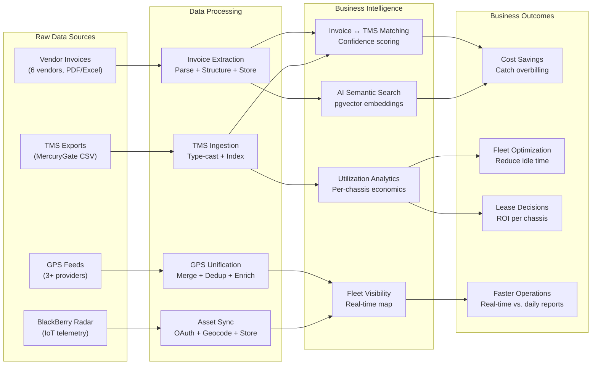
```mermaid
graph LR
    subgraph "Raw Data Sources"
        GPS_RAW["GPS Feeds<br/>(3+ providers)"]
        INV_RAW["Vendor Invoices<br/>(6 vendors, PDF/Excel)"]
        TMS_RAW["TMS Exports<br/>(MercuryGate CSV)"]
        BB_RAW["BlackBerry Radar<br/>(IoT telemetry)"]
    end

    subgraph "Data Processing"
        GPS_UNIFY["GPS Unification<br/>Merge + Dedup + Enrich"]
        INV_EXTRACT["Invoice Extraction<br/>Parse + Structure + Store"]
        TMS_INGEST["TMS Ingestion<br/>Type-cast + Index"]
        BB_SYNC["Asset Sync<br/>OAuth + Geocode + Store"]
    end

    subgraph "Business Intelligence"
        MATCH["Invoice ↔ TMS Matching<br/>Confidence scoring"]
        UTIL["Utilization Analytics<br/>Per-chassis economics"]
        SEARCH["AI Semantic Search<br/>pgvector embeddings"]
        MAP["Fleet Visibility<br/>Real-time map"]
    end

    subgraph "Business Outcomes"
        SAVE["Cost Savings<br/>Catch overbilling"]
        OPTIMIZE["Fleet Optimization<br/>Reduce idle time"]
        DECIDE["Lease Decisions<br/>ROI per chassis"]
        SPEED["Faster Operations<br/>Real-time vs. daily reports"]
    end

    GPS_RAW --> GPS_UNIFY
    INV_RAW --> INV_EXTRACT
    TMS_RAW --> TMS_INGEST
    BB_RAW --> BB_SYNC

    GPS_UNIFY --> MAP
    INV_EXTRACT --> MATCH
    TMS_INGEST --> MATCH
    TMS_INGEST --> UTIL
    BB_SYNC --> MAP
    INV_EXTRACT --> SEARCH

    MATCH --> SAVE
    UTIL --> OPTIMIZE
    UTIL --> DECIDE
    MAP --> SPEED
    SEARCH --> SAVE
```

### 10.2 Risk Matrix

| Risk | Without System | With System | Severity |
|---|---|---|---|
| **Invoice overbilling** | Undetected; vendor bills accepted at face value | Automated TMS matching catches date, amount, and equipment mismatches | HIGH |
| **Idle chassis (hidden cost)** | No visibility; company pays lease on unused chassis | Per-chassis utilization % with idle day tracking and cost attribution | HIGH |
| **Lost/stolen chassis** | Discovered weeks later when vendor reports | Real-time GPS map with last-seen timestamps and geofence alerts | MEDIUM |
| **Duplicate charges** | Manual Excel cross-referencing (error-prone) | Semantic search + structured matching across all vendors | MEDIUM |
| **Slow dispute resolution** | Email threads with no audit trail | Structured dispute workflow with reasons, history, and evidence | MEDIUM |
| **Vendor negotiation weakness** | No data to support rate discussions | Utilization data, revenue per chassis, cost per day by vendor | HIGH |
| **Operational blindness** | Daily manual reports from each GPS provider | Unified dashboard with 5-minute auto-refresh | LOW |

### 10.3 ROI Narrative

**Scenario: Trucking company with 500 chassis across 6 vendors**

Assume average daily lease rate of $35/chassis and average monthly invoice of $525,000 across all vendors.

**1. Catching 2% Invoice Overbilling**
- Monthly invoices: $525,000
- 2% overbilling detected: **$10,500/month = $126,000/year**
- Common catches: extra billing days (vendor hasn't processed return), wrong chassis assignment, duplicate line items
- The `validate_dcli_invoice()` function matches each line item against TMS records with a confidence score. Lines below 60% confidence are flagged for dispute.

**2. Reducing Chassis Idle Time by 5%**
- 500 chassis × 365 days × $35/day = $6,387,500 total annual lease cost
- Current utilization assumed at 65% → 35% idle days = $2,235,625 wasted
- 5% idle reduction = $2,235,625 × (5/35) = **$319,375/year saved**
- Achieved by: identifying chronically underused chassis (UtilizationTab shows per-chassis %, idle days, revenue/day), returning or redeploying them

**3. Real-Time Visibility vs. Daily Manual Reports**
- Time saved: 2 dispatchers × 1 hour/day checking vendor portals = 520 hours/year
- At $30/hour = **$15,600/year in labor savings**
- Plus qualitative benefits: faster dispatch decisions, fewer customer delays, reduced phone calls to GPS vendors

**Combined Annual Value: ~$461,000/year**

This does not include:
- Reduced dispute resolution time (currently 2-4 weeks → same day)
- Better vendor rate negotiations backed by utilization data
- Avoided penalties for lost/unreturned chassis
- Insurance premium reductions from tracked fleet

---

*Report generated from source code analysis of the Chassis Compass Navigator codebase (commit 9ff58d7, branch main). All file references verified against actual source files.*
