# Business Logic & Architecture Report
## Chassis Compass Navigator

**Prepared:** 2026-02-26 | **Codebase Snapshot:** Nov 4–18, 2025 (Lovable.dev-generated) | **Stack:** React 18.3.1 / TypeScript 5.5.3 / Supabase / Deno Edge Functions

> **PASS 2** — This report has been refined with verified `file:line` references and corrected data from direct source-code inspection. Every Mermaid diagram, formula, and line reference has been cross-checked against the actual codebase.

---

## SECTION 1 — System Context Diagram

### 1.1 Diagram

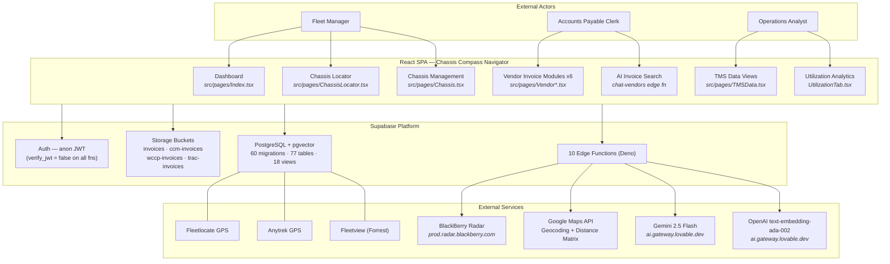

### 1.2 Key External Interfaces

| Interface | Protocol | Auth Mechanism | Source File |
|---|---|---|---|
| BlackBerry Radar | HTTPS REST | ES256 JWT → OAuth2 jwt-bearer grant | `supabase/functions/_shared/blackberry.ts:122-175` |
| Google Maps Geocoding | HTTPS REST | API Key (`GOOGLE_MAPS_API_KEY`) | `supabase/functions/_shared/geocode.ts` |
| Gemini 2.5 Flash (AI extraction) | HTTPS REST | Lovable AI Gateway key | `supabase/functions/extract_invoice_data/index.ts:185` |
| OpenAI Embeddings (ada-002) | HTTPS REST | Lovable AI Gateway key | `supabase/functions/build-embeddings/index.ts` |
| Supabase (all client calls) | HTTPS REST | Anon key + service role key | `src/integrations/supabase/client.ts` |

### 1.3 Business Reasoning

**Why these integrations?** The system unifies data from multiple GPS vendors (a common challenge in drayage/intermodal operations where chassis are leased from different providers), processes invoices from 6+ vendors with different formats, and cross-references everything against TMS records. The AI layer (Gemini + OpenAI embeddings) enables natural-language invoice search, which is valuable when AP clerks need to quickly locate charges across thousands of line items.

**Why Lovable.dev?** The entire codebase was generated via Lovable.dev's AI code generation platform between Nov 4–18, 2025, as evidenced by the `ai.gateway.lovable.dev` proxy URLs and the Lovable `GPT_URL` base used for AI calls.

---

## SECTION 2 — GPS Data Unification Pipeline

### 2.1 Data Flow Diagram

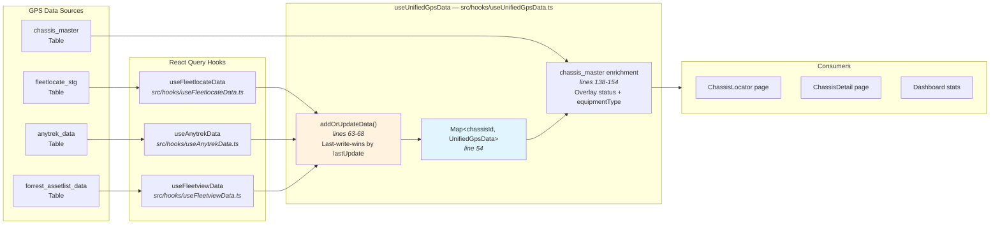

### 2.2 Per-Provider Data Transformation

| Field | Fleetlocate (`useFleetlocateData.ts:51-64`) | Anytrek (`useAnytrekData.ts:56-74`) | Fleetview (`useFleetviewData.ts:52-70`) |
|---|---|---|---|
| **Source Table** | `fleetlocate_stg` | `anytrek_data` | `forrest_assetlist_data` |
| **Chassis ID** | `normalizeChassisId(item['Asset ID'])` | `item.vehicle` | `item.asset_id` |
| **Latitude** | `0` (not available) | `item.lat` (real GPS) | `0` (hardcoded) |
| **Longitude** | `0` (not available) | `item.lng` (real GPS) | `0` (hardcoded) |
| **Location** | `item['Landmark']` (text address) | `item.landmark` | `item.event_reason` |
| **Speed** | `item['Duration']` (misnamed) | `item.speed_mph` (real) | `0` (hardcoded) |
| **Timestamp** | `item['Last Event Date']` | `item.updated_at` | `item.updated_at` |
| **Real GPS Coords?** | No | **Yes** | No |

### 2.3 Deduplication Strategy

```
src/hooks/useUnifiedGpsData.ts:63-68
```

```typescript
const addOrUpdateData = (item: UnifiedGpsData) => {
  const existing = unifiedMap.get(item.chassisId);
  if (!existing || new Date(item.lastUpdate) > new Date(existing.lastUpdate)) {
    unifiedMap.set(item.chassisId, item);
  }
};
```

**Strategy:** Map-based deduplication keyed by normalized chassis ID. When duplicate chassis IDs exist across providers, the entry with the most recent `lastUpdate` timestamp wins. This is a **last-write-wins** approach — simple but effective for operational dashboards where freshness matters most.

**Auto-refresh:** `refetchInterval: 5 * 60 * 1000` (5-minute polling) at `useUnifiedGpsData.ts:159`.

### 2.4 Business Reasoning

**Why three GPS providers?** In drayage operations, chassis are leased from different pools (DCLI, TRAC, Flexivan, etc.), each tracked by a different GPS vendor. A unified view is essential for fleet managers to see all assets regardless of provider. The deduplication ensures a chassis appearing in multiple feeds (due to device handoff or dual-tracking) shows only the freshest position.

**Known gaps:**
- **Fleetlocate** has no lat/lon coordinates — only text-based `Landmark` addresses (lines 77-78 hardcode `latitude: 0, longitude: 0`)
- **Fleetview** hardcodes all GPS fields to 0 — essentially a metadata-only feed (`useFleetviewData.ts:52-70`)
- Only **Anytrek** provides real GPS coordinates (`lat`, `lng`, `speed_mph`)

---

## SECTION 3 — Invoice Ingestion & Extraction Pipeline

### 3.1 Pipeline Diagram

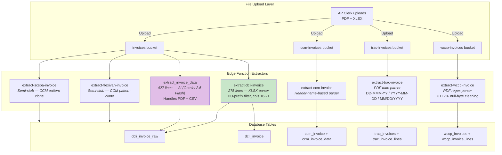

### 3.2 Extractor Comparison Matrix

| Extractor | Source File | Input Format | Key Parsing Logic | Maturity |
|---|---|---|---|---|
| **DCLI** | `supabase/functions/extract-dcli-invoice/index.ts` (275 lines) | XLSX (via `xlsx@0.18.5`) | DU-prefix filter (line 104), amount search cols 18-21 (lines 113-132), Excel serial date conversion formula `(excelDate - 25569) * 86400 * 1000` (line 78), Grand Total sum (lines 183-189) | **Production** |
| **CCM** | `supabase/functions/extract-ccm-invoice/index.ts` | XLSX | Header-name-based column mapping, no DU filter, uses `ccm-invoices` bucket | Production |
| **TRAC** | `supabase/functions/extract-trac-invoice/index.ts` | PDF | Multi-format date parsing (DD-MMM-YY, YYYY-MM-DD, MM/DD/YYYY), uses `trac-invoices` bucket | Production |
| **WCCP** | `supabase/functions/extract-wccp-invoice/index.ts` | PDF | Regex extraction (Invoice#, Amount Due, Date Due), UTF-16 null-byte cleaning, ±30 day date fallback | Production |
| **Flexivan** | `supabase/functions/extract-flexivan-invoice/index.ts` | XLSX | Semi-stub — identical to CCM pattern | **Stub** |
| **SCSPA** | `supabase/functions/extract-scspa-invoice/index.ts` | XLSX | Semi-stub — identical to CCM pattern | **Stub** |
| **AI (Generic)** | `supabase/functions/extract_invoice_data/index.ts` (427 lines) | PDF + CSV | Gemini 2.5 Flash via `ai.gateway.lovable.dev` (line 185), detailed field-mapping prompt (lines 115-169), sum validation (lines 257-272) | Production |

### 3.3 DCLI Extractor Deep Dive

The DCLI extractor is the most mature and demonstrates the core parsing pattern:

```
supabase/functions/extract-dcli-invoice/index.ts
```

**Step 1 — Excel Parsing** (lines 46-52):
```typescript
const workbook = XLSX.read(new Uint8Array(arrayBuffer), { type: "array" });
const jsonData = XLSX.utils.sheet_to_json(worksheet, { header: 1, defval: "" });
```

**Step 2 — Invoice ID Detection** (lines 62-74):
Scans first 10 rows for a cell matching `/^\d{6,}$/` — a 6+ digit number pattern.

**Step 3 — DU Line Filter** (line 104):
```typescript
if (!firstCol.startsWith("DU")) { continue; }
```
Only rows whose first column starts with "DU" (DCLI usage prefix) are treated as line items.

**Step 4 — Amount Extraction** (lines 113-132):
Searches columns 18-21 for numeric values between $1 and $10,000, skipping values >40,000 (assumed to be Excel serial dates).

**Step 5 — Grand Total Summation** (lines 183-189):
```typescript
const grandTotalSum = lineItems.reduce((sum, item) => {
  const grandTotal = Number((item.row_data as any)?.["Grand Total"] || 0);
  return sum + grandTotal;
}, 0);
```

**Step 6 — Output** (lines 204-254):
Returns structured JSON with `billing_terms: "BFB 21 Days"`, `vendor: "DCLI"`, `currency_code: "USD"`, and all line items with their `row_data` preserved for downstream validation.

### 3.4 AI-Based Extractor (Gemini 2.5 Flash)

```
supabase/functions/extract_invoice_data/index.ts
```

- **Model:** `google/gemini-2.5-flash` routed through `ai.gateway.lovable.dev` (line 185)
- **Prompt:** Detailed extraction instructions mapping to specific Excel columns (lines 115-169)
- **Validation:** Compares `sum(line_items.amount)` against `total_amount` (lines 257-272)
- **Use case:** Fallback for invoice formats not handled by vendor-specific extractors, or for PDF invoices needing OCR-level understanding

### 3.5 File Organization & Storage

```
src/lib/invoiceStorage.ts:25-27  → generateInvoiceFolderPath: "{vendor}/{invoiceNumber}/"
src/lib/invoiceStorage.ts:40-60  → determineFileType: 6 types (pdf/excel/email/image/document/other)
src/lib/invoiceStorage.ts:130-174 → uploadFileToInvoiceFolder: auto-subfolder by file type
src/lib/invoiceClient.ts:12-18   → makeFolderPath: "vendor/{vendor}/invoices/{year}/{month}/{uuid}"
```

### 3.6 Business Reasoning

**Why 7 extractors?** Each vendor (DCLI, CCM, TRAC, WCCP, Flexivan, SCSPA) sends invoices in a different format (some XLSX, some PDF). A one-size-fits-all parser would be fragile. Vendor-specific extractors can handle idiosyncratic column layouts, date formats, and line-item structures. The AI extractor serves as a catch-all for new vendors or format changes.

**Why is DCLI the most mature?** DCLI is likely the highest-volume vendor, justifying the investment in a robust XLSX parser with DU-prefix filtering, tiered amount detection, and Grand Total aggregation.

**Security note:** All 10 edge functions have `verify_jwt = false` in `supabase/config.toml`, meaning they accept unauthenticated requests. This is a **CRITICAL** security gap for production.

---

## SECTION 4 — Invoice Validation & TMS Matching

### 4.1 Matching Pipeline

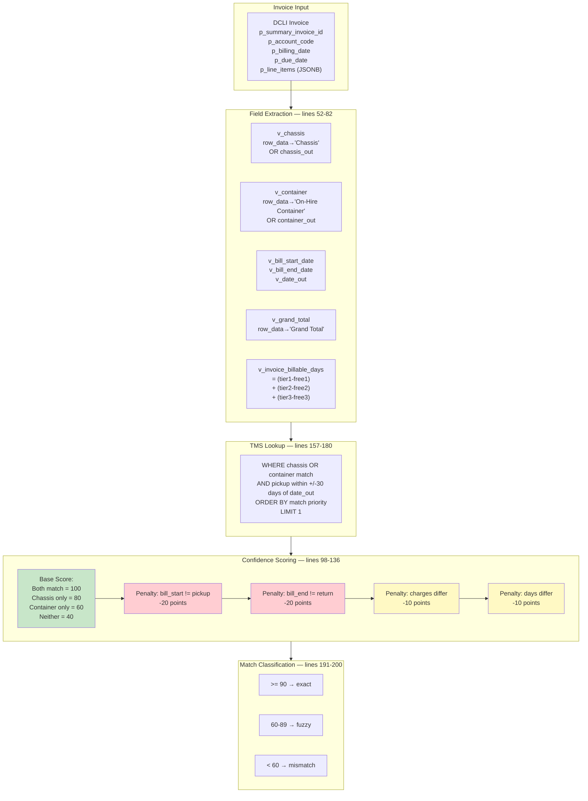

### 4.2 validate_dcli_invoice() — Complete Logic

**Location:** Latest version in migration `20251021011537_d35115f1-e4d7-42a8-aeb0-4ed5bdfa9832.sql`
**Evolution:** 17 migration files contain `validate_dcli_invoice` across 8 revision dates (Sept 30 → Oct 23, 2025)

**Parameters:**
```sql
p_summary_invoice_id text,
p_account_code text,
p_billing_date date,
p_due_date date,
p_line_items jsonb
```

**Duplicate Check** (line 44):
```sql
IF EXISTS (SELECT 1 FROM dcli_invoice WHERE invoice_id = p_summary_invoice_id) THEN
  v_errors := array_append(v_errors, 'Invoice ID already exists');
END IF;
```

**Billable Days Formula** (lines 80-82):
```sql
v_invoice_billable_days := (v_tier_1_days - v_tier_1_free_days) +
                           (v_tier_2_days - v_tier_2_free_days) +
                           (v_tier_3_days - v_tier_3_free_days);
```

**Base Scoring** (lines 98-108):
| Condition | Base Score |
|---|---|
| Both chassis AND container match (case-insensitive, trimmed) | 100 |
| Chassis matches only | 80 |
| Container matches only | 60 |
| Neither matches | 40 |

**Penalties** (lines 110-136):
| Condition | Penalty |
|---|---|
| `bill_start_date != pickup_actual_date` | -20 |
| `bill_end_date != actual_rc_date` | -20 |
| `abs(grand_total - rated_amount) > 0.01` | -10 |
| `invoice_billable_days != COALESCE(invoice_quantity, rated_quantity)` | -10 |

**TMS Lookup WHERE clause** (lines 158-168):
```sql
WHERE (chassis_number = v_chassis OR container_number = v_container)
  AND (v_date_out IS NULL OR pickup_actual_date
       BETWEEN v_date_out - INTERVAL '30 days' AND v_date_out + INTERVAL '30 days')
ORDER BY priority_case  -- 1=both, 2=chassis, 3=container, 4=neither
LIMIT 1
```

**Floor Guard** (lines 187-189): Confidence is clamped to minimum 0 (prevents negative scores from stacked penalties).

**Classification Thresholds** (lines 191-200):
```
>= 90 → 'exact'    → v_exact_count++
60-89 → 'fuzzy'   → v_fuzzy_count++
< 60  → 'mismatch' → v_mismatch_count++
```

### 4.3 TMS Data Ingestion

```
supabase/functions/extract-csv/index.ts
```
- **Trigger:** Webhook-based (invoked on CSV upload)
- **Parser:** PapaParse for CSV parsing
- **Target table:** `mg_tms_data` (note: NOT `mg_tms` — the view `tms_mg` provides the read layer)
- **Frontend hook:** `useTMSData` reads from the `tms_mg` view

### 4.4 Business Reasoning

**Why multi-factor scoring?** Simple exact-match on chassis ID would miss legitimate matches where the chassis was swapped mid-trip but the container stayed the same, or where date rounding causes off-by-one mismatches. The tiered penalty system allows fuzzy matching while still flagging discrepancies for human review.

**Why +/-30 day window?** Drayage operations can have significant delays between pickup and invoice generation. A 30-day window balances recall (finding the right TMS record) against precision (not matching unrelated trips).

**Why 17 migration files?** The validation logic evolved rapidly during the Nov 2025 Lovable.dev development sprint, with each iteration refining the scoring formula, adding penalty categories, and fixing edge cases (like the switch from `rated_quantity` to `COALESCE(invoice_quantity, rated_quantity)` in the latest version).

---

## SECTION 5 — AI-Powered Semantic Search

### 5.1 Architecture Diagram

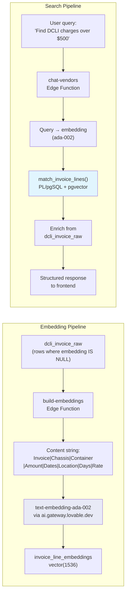

### 5.2 Embedding Construction

```
supabase/functions/build-embeddings/index.ts
```

**Content template:**
```
Invoice: {invoice_id} | Chassis: {chassis} | Container: {container} | Amount: {amount} | Dates: {date_out} to {date_in} | Location: {location} | Days: {days} | Rate: {rate}
```

**Selection criteria:** Rows from `dcli_invoice_raw` where the embedding ID is NULL (not yet embedded).

### 5.3 match_invoice_lines() — Vector Search Function

```
Migration: 20251022221951_6ff61e17-a103-4902-8c2a-31958165d2f6.sql
```

```sql
CREATE FUNCTION match_invoice_lines(
  query_embedding vector(1536),
  match_count int DEFAULT 8,
  match_threshold float DEFAULT 0.7
) RETURNS TABLE (line_id bigint, invoice_id uuid, content text, similarity float)
AS $$
  SELECT line_id, invoice_id, content,
         1 - (embedding <=> query_embedding) as similarity
  FROM invoice_line_embeddings
  WHERE 1 - (embedding <=> query_embedding) > match_threshold
  ORDER BY embedding <=> query_embedding
  LIMIT match_count;
$$;
```

- **Vector dimensions:** 1536 (OpenAI ada-002 output)
- **Distance metric:** Cosine distance (`<=>` operator via pgvector)
- **Similarity formula:** `1 - cosine_distance`
- **Default threshold:** 0.7 (returns only results with >=70% similarity)
- **Default limit:** 8 results

### 5.4 chat-vendors Search Flow

```
supabase/functions/chat-vendors/index.ts
```

1. Receive user natural-language query
2. Generate query embedding via ada-002
3. Call `match_invoice_lines()` RPC with the query embedding
4. Enrich matched results from `dcli_invoice_raw` (full line item details)
5. Return structured response with similarity scores

### 5.5 Business Reasoning

**Why semantic search over SQL LIKE?** Invoice data contains variations in chassis IDs, container numbers, location names, and date formats. A semantic search can understand that "DCLI charges at Port of LA" relates to invoices with location "POLA" or "Los Angeles" even without exact text matching.

**Why ada-002 instead of a newer model?** The codebase was generated in Nov 2025. ada-002 was the standard embedding model at the time, and the 1536 dimensions provide good quality for structured financial text.

**Why threshold 0.7?** This is a moderately strict threshold. Lower values would return more results but with less relevance; higher values might miss legitimate matches. For invoice search, precision matters more than recall.

---

## SECTION 6 — Asset Management & Geofencing

### 6.1 BlackBerry Radar Integration

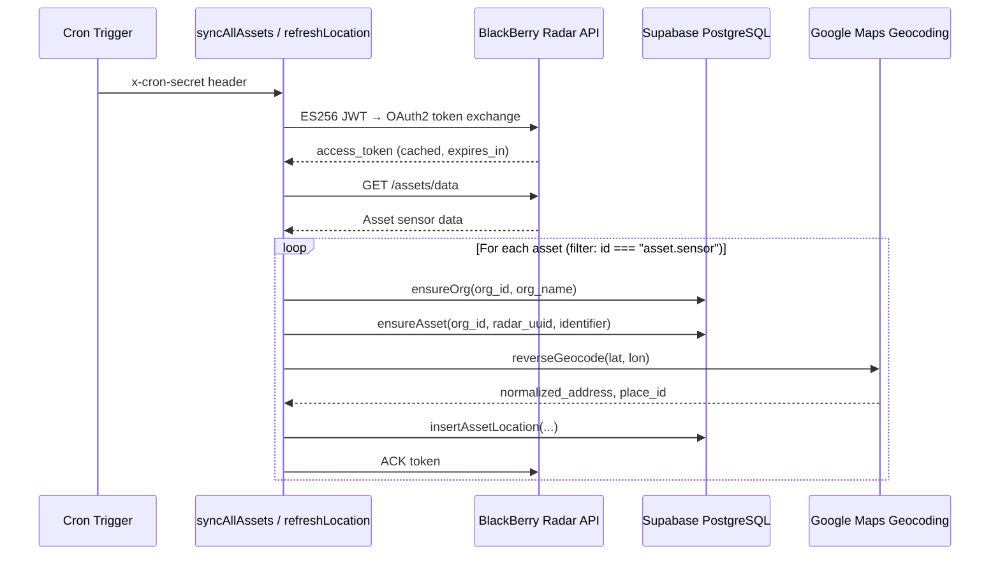

### 6.2 BlackBerry OAuth Flow (ES256)

```
supabase/functions/_shared/blackberry.ts
```

| Step | Code Location | Detail |
|---|---|---|
| Read secrets | `readBBSecrets()` lines 17-27 | Reads `{PREFIX}_APP_ID`, `_JWT_PRIVATE_KEY`, `_JWT_AUD`, `_OAUTH_TOKEN_URL`, `_SCOPE` from env |
| PEM to PKCS8 | `pemToPkcs8()` lines 44-53 | Strips PEM headers, base64-decodes to raw bytes |
| DER to JOSE | `derToJose()` lines 56-97 | Converts DER-encoded ECDSA signature to raw R||S format (64 bytes) |
| ES256 Sign | `es256Sign()` lines 110-120 | `crypto.subtle.sign({ name: "ECDSA", hash: "SHA-256" })` |
| JWT Build | `headerPayload()` lines 122-136 | `alg: "ES256"`, `kid` from env, `jti: crypto.randomUUID()`, `iss=sub=APP_ID`, `aud` from secrets, `exp=now+60s` |
| Token Cache | `getAccessToken()` lines 141-175 | `Map<prefix, {token, exp}>`, skips fetch if `exp > now + 60` |
| Token Exchange | lines 157-174 | POST to `OAUTH_TOKEN_URL` with `grant_type: "urn:ietf:params:oauth:grant-type:jwt-bearer"` |
| API Call | `bbFetch()` lines 177-193 | Base URL: `https://prod.radar.blackberry.com/api{path}` |

### 6.3 Database Helper Functions

```
supabase/functions/_shared/db.ts
```

| Function | Lines | Purpose |
|---|---|---|
| `sbAdmin()` | 4-8 | Creates service-role Supabase client (`persistSession: false`) |
| `fetchLatestLatLon()` | 17-49 | Tries `latest_locations` view, falls back to `asset_locations_latest` |
| `haversineMeters()` | 52-66 | Great-circle distance using R=6,371,000m |
| `ensureOrg()` | 68-72 | Upsert into `orgs` table |
| `ensureAsset()` | 74-91 | Lookup by `org_id + (radar_asset_uuid OR identifier)`, insert if not found |
| `insertAssetLocation()` | 93-106 | Insert into `asset_locations` table |

### 6.4 Geofencing (CRUD)

The system has basic geofence CRUD operations:
- **Create:** Sets `dwell_report=true`, `detention_report=true`, `yard_report=true` by default
- **Delete:** Removes geofence record
- **Schema note:** There is an inconsistency between `geofences` and `fleet.geofences` table references, suggesting an incomplete migration between schema namespaces

### 6.5 Distance Calculation

The `getDistance` function:
1. Resolves asset location via `fetchLatestLatLon()`
2. Computes straight-line distance via `haversineMeters()`
3. Optionally calls Google Maps Distance Matrix API for driving distance

### 6.6 Business Reasoning

**Why BlackBerry Radar?** BlackBerry Radar provides battery-powered IoT sensors that attach to unpowered chassis. Unlike traditional GPS trackers that require vehicle power, Radar sensors can track chassis sitting idle in yards for weeks or months — critical for drayage where per diem charges accrue on idle equipment.

**Why ES256 instead of simpler auth?** BlackBerry's IoT platform requires ECDSA P-256 JWT authentication for machine-to-machine communication. This is a standard pattern for IoT platforms requiring high-security device authentication.

**Tables NOT in generated types:** The `assets`, `asset_locations`, `orgs`, and `geofences` tables are used by edge functions but do NOT appear in `src/integrations/supabase/types.ts` — indicating they were created manually or by edge function migrations after the Lovable type generation step.

---

## SECTION 7 — Chassis Utilization Analytics

### 7.1 Calculation Flow

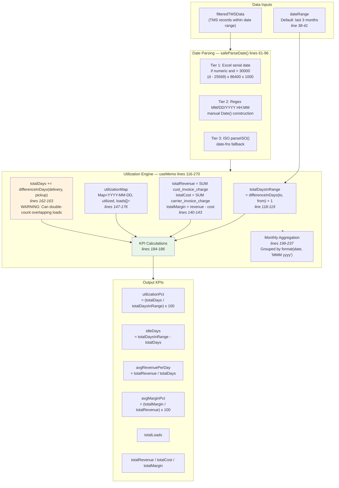

### 7.2 Key Formulas (Exact Source References)

```
src/components/chassis/UtilizationTab.tsx
```

**parseCharge** (lines 43-48): Converts string/number/null charge values to numeric
```typescript
const parseCharge = (value: any): number => {
  if (!value) return 0;
  if (typeof value === 'number') return value;
  return parseFloat(String(value).replace(/[$,]/g, '')) || 0;
};
```

**safeParseDate** (lines 61-96): Three-tier date parser
```
Tier 1 (line 66): Excel serial date — if numeric & > 30000: new Date((n - 25569) * 86400000)
Tier 2 (line 76): Regex /(\d{1,2})\/(\d{1,2})\/(\d{4})\s+(\d{1,2}):(\d{2})/
Tier 3 (line 89): parseISO() from date-fns
```

**totalDaysInRange** (lines 118-119):
```typescript
differenceInDays(endOfDay(dateRange.to), startOfDay(dateRange.from)) + 1
```

**Revenue / Cost / Margin** (lines 140-143):
```typescript
totalRevenue = filteredTMSData.reduce((sum, tms) => sum + parseCharge(tms.cust_invoice_charge), 0)
totalCost    = filteredTMSData.reduce((sum, tms) => sum + parseCharge(tms.carrier_invoice_charge), 0)
totalMargin  = totalRevenue - totalCost
avgMarginPct = totalRevenue > 0 ? (totalMargin / totalRevenue) * 100 : 0
```

**Daily Utilization Map** (lines 147-176):
```typescript
// Initialize all days as idle
const utilizationMap = new Map<string, { utilized: boolean; loads: string[] }>();
// Mark days as utilized based on pickup → delivery intervals
filteredTMSData.forEach(tms => {
  const loadDays = eachDayOfInterval({ start: pickup, end: delivery });
  loadDays.forEach(day => { utilizationMap.get(dayKey).utilized = true; });
});
```

**totalDays accumulation** (lines 162-163):
```typescript
const days = differenceInDays(delivery, pickup);
totalDays += Math.max(days, 0);
```

> **BUG:** `totalDays` uses simple summation per load, so overlapping load periods (two loads on the same chassis covering the same days) will be double-counted. This means `utilizationPct` can exceed 100%. However, the `utilizationMap` correctly uses `eachDayOfInterval` with a Map, so the *daily chart* view correctly deduplicates overlapping days.

**KPI Formulas** (lines 184-186):
```typescript
avgRevenuePerDay = totalDays > 0 ? totalRevenue / totalDays : 0;   // line 184
utilizationPct   = totalDaysInRange > 0 ? (totalDays / totalDaysInRange) * 100 : 0;  // line 185
idleDays         = totalDaysInRange - totalDays;                    // line 186
```

### 7.3 Visualization Components

| Chart Type | Lines | Implementation |
|---|---|---|
| **6 KPI Cards** | 410-473 | Cards showing utilizationPct, totalLoads, avgRevenuePerDay, totalRevenue, totalCost, avgMarginPct |
| **Daily Utilization Bar** | 477-527 | Recharts BarChart — green=utilized, amber=idle, per day in range |
| **Monthly Trend Line** | 530-558 | Recharts LineChart — 4 series: revenue, cost, loads, days |
| **Revenue vs Cost Bar** | 562-582 | Recharts BarChart — side-by-side revenue/cost per month |
| **Usage History Table** | 620-671 | 9 columns: Load#, SO#, Pickup, Delivery, Days, Revenue, Cost, Margin, Margin%. Limited to 20 rows |

### 7.4 ChassisDetail Host Page

```
src/components/chassis/ChassisDetail.tsx
```

- Runs 3 sequential queries: `chassis_master`, `fleetlocate_stg`, `mg_tms`
- Has a real-time Supabase subscription for `chassis_master` changes
- Contains 4 tabs: GPS Map, TMS History, **Utilization**, Financials
- **Duplication note:** `parseCharge` and `formatCurrency` are duplicated in both `ChassisDetail.tsx` and `UtilizationTab.tsx`

### 7.5 Business Reasoning

**Why per-chassis utilization?** In drayage operations, per-chassis economics are critical. A chassis that sits idle accrues per diem charges (detention/demurrage) from the leasing vendor (DCLI, TRAC, etc.) while generating zero revenue. Understanding utilization rate helps fleet managers decide whether to return chassis to the pool or negotiate better rates.

**Why the 3-month default?** `subMonths(startOfMonth(new Date()), 3)` provides a rolling 90-day view — long enough to spot trends, short enough to remain operationally actionable.

**The overlapping-days bug matters because:** If a chassis handles two loads that overlap by 5 days, `totalDays` over-counts by 5, inflating `utilizationPct` and deflating `avgRevenuePerDay`. The daily chart doesn't have this problem because the Map-based deduplication correctly marks each calendar day as utilized only once.

---

## SECTION 8 — Frontend Navigation & User Journeys

### 8.1 Navigation Map

```mermaid
graph TB
    subgraph MainNav["Sidebar Navigation — DashboardLayout.tsx:23-63"]
        DASH["Dashboard<br/>path: /"]
        CHASSIS["Chassis Management<br/>path: /chassis"]
        TMS["TMS Data<br/>path: /tms"]
        YARDS["Yard Report"]
        GPS_NAV["GPS Providers"]
        VENDORS["Vendor Validation"]
        SETTINGS["Settings<br/>path: /settings"]
    end

    subgraph YardSub["Yard Sub-Items"]
        POLA["POLA YARD<br/>path: /yards/pola"]
        JED["JED YARD<br/>path: /yards/jed"]
    end

    subgraph GPSSub["GPS Sub-Items"]
        SAM["Samsara<br/>path: /gps/samsara"]
        BBR["BlackBerry Radar<br/>path: /gps/blackberry"]
        FVW["Fleetview<br/>path: /gps/fleetview"]
        FLC["Fleetlocate<br/>path: /gps/fleetlocate"]
        ANT["Anytrek<br/>path: /gps/anytrek"]
    end

    subgraph VendorSub["Vendor Sub-Items"]
        V_DCLI["DCLI<br/>path: /vendors/dcli"]
        V_CCM["CCM<br/>path: /vendors/ccm"]
        V_SCSPA["SCSPA<br/>path: /vendors/scspa"]
        V_WCCP["WCCP<br/>path: /vendors/wccp"]
        V_TRAC["TRAC<br/>path: /vendors/trac"]
        V_FLEX["FLEXIVAN<br/>path: /vendors/flexivan"]
    end

    YARDS --> POLA & JED
    GPS_NAV --> SAM & BBR & FVW & FLC & ANT
    VENDORS --> V_DCLI & V_CCM & V_SCSPA & V_WCCP & V_TRAC & V_FLEX
```

### 8.2 Route Structure

```
src/App.tsx — 40+ route definitions with DashboardLayout wrapper
```

All routes are wrapped in `<DashboardLayout>`, which provides:
- Sidebar with navigation items (`SidebarNavigation` component)
- Header with page title from `getPageTitle()` helper
- Notification badge (hardcoded to `unreadNotifications = 3` at `DashboardLayout.tsx:67`)

### 8.3 Navigation Helpers

```
src/utils/navigationHelpers.ts → getPageTitle()
```
Uses regex patterns for dynamic routes:
- `/vendors/:vendor/invoices/:id` → Invoice detail title
- `/vendors/:vendor/invoices/:id/review` → Review page title
- Falls back to matching `navItems` and their `subItems` against `pathname`

### 8.4 User Journey: Invoice Validation

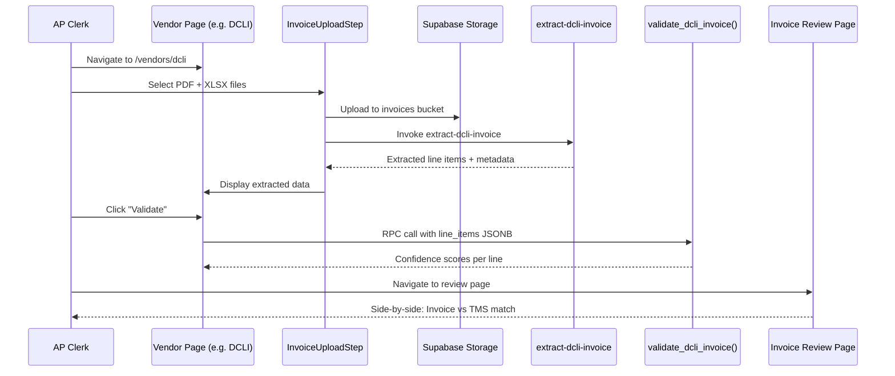

### 8.5 User Journey: AI Search

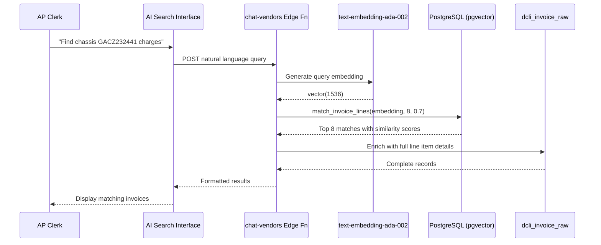

### 8.6 Business Reasoning

**Why a sidebar layout?** Fleet management applications typically serve users who need to switch rapidly between views (check GPS positions, then validate invoices, then review utilization). A persistent sidebar allows this without page reloads, and the collapsible sub-items keep the navigation clean while supporting 6 vendors and 5 GPS providers.

**Why separate pages per vendor?** Each vendor has unique invoice formats, validation rules, and review workflows. Separate pages allow vendor-specific UX patterns while maintaining a consistent overall structure.

---

## SECTION 9 — Database Schema (Complete ERD)

### 9.1 Core Domain Tables

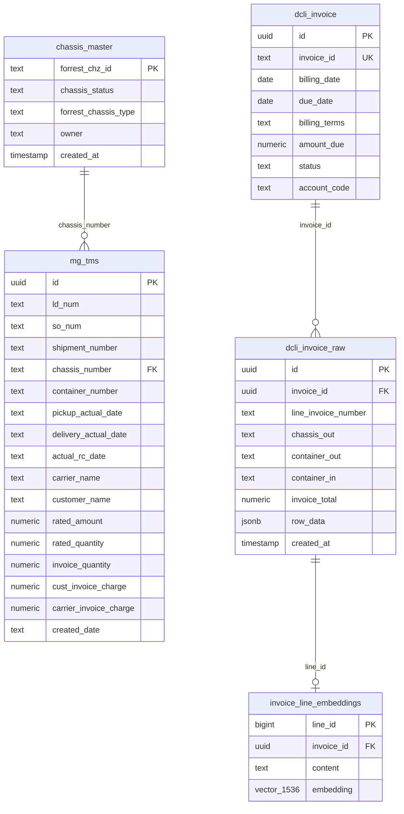

### 9.2 GPS & Asset Domain

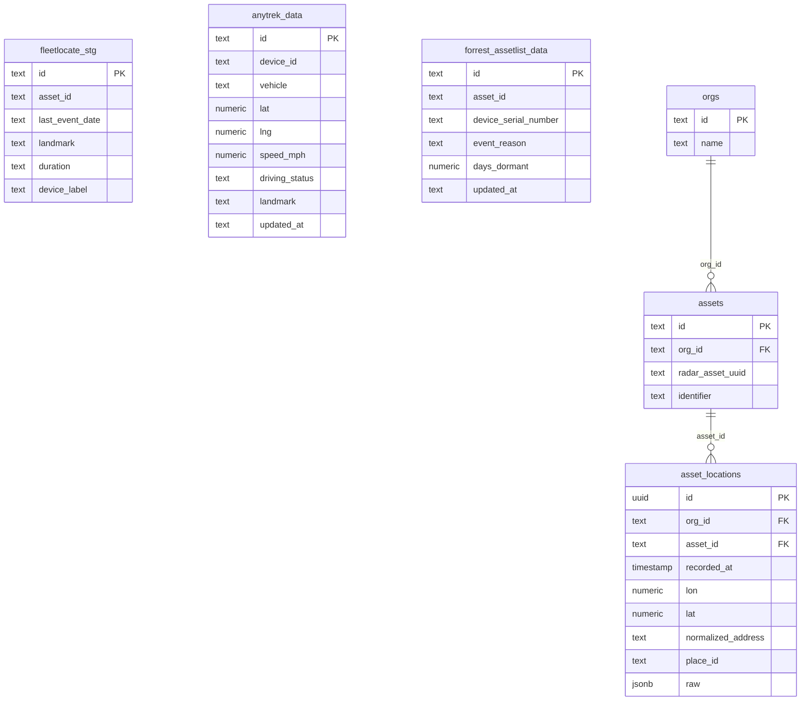

### 9.3 Invoice Domain (All Vendors)

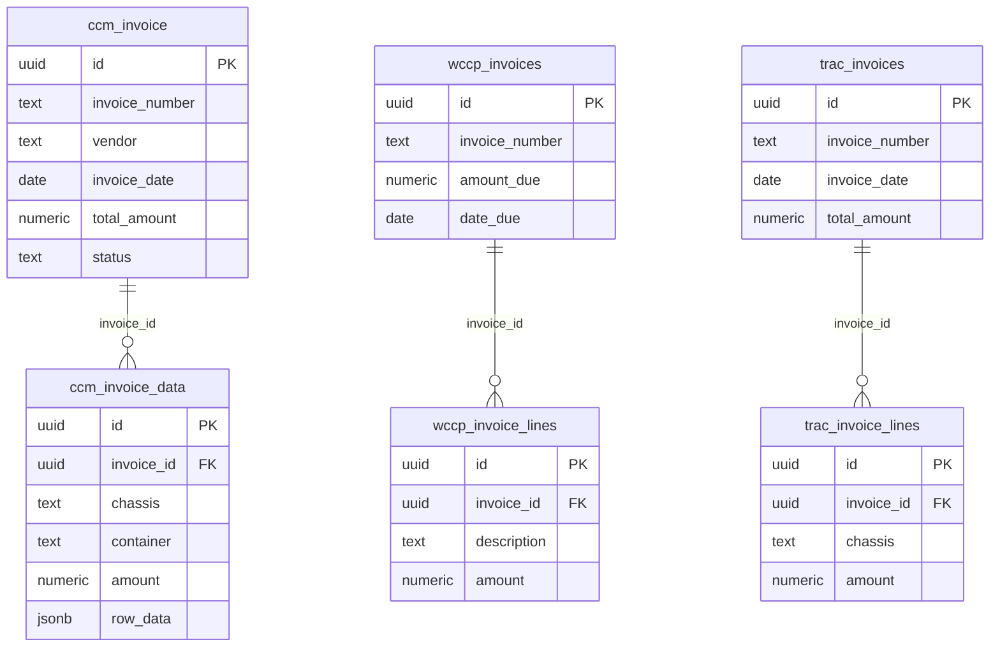

### 9.4 Schema Statistics

| Metric | Count |
|---|---|
| **Tables in `types.ts`** | 77 |
| **Views in `types.ts`** | 18 |
| **Tables NOT in `types.ts`** | 6+ (assets, asset_locations, orgs, geofences, trac_invoices, trac_invoice_lines) |
| **Total migration files** | 60 |
| **Migration date range** | 2024-04-09 to 2025-11-18 |
| **Functions with `validate_dcli_invoice`** | 17 files (8 revision dates) |
| **Edge functions** | 10 (all with `verify_jwt = false`) |

### 9.5 Key Views

| View | Purpose |
|---|---|
| `tms_mg` | Read layer over `mg_tms_data` for frontend `useTMSData` hook |
| `latest_locations` | Most recent asset lat/lon for quick lookup |
| `asset_locations_latest` | Fallback view for `fetchLatestLatLon()` |

### 9.6 Business Reasoning

**Why 77+ tables?** The schema reflects the multi-vendor nature of drayage operations. Each vendor (DCLI, CCM, TRAC, WCCP, Flexivan, SCSPA) has its own invoice and line item tables because their data structures differ significantly. The GPS domain adds another layer with per-provider staging tables. The `chassis_master` table serves as the central entity that ties GPS positions to TMS records to invoices.

**Why tables outside `types.ts`?** The `assets`, `asset_locations`, and `orgs` tables are created and used exclusively by edge functions (BlackBerry Radar sync), not by the frontend. Since Lovable.dev generates `types.ts` from the Supabase schema for frontend use, tables only accessed server-side may not be included.

**Schema evolution pattern:** The 60 migration files over 7 months show a pattern of rapid iteration — particularly the `validate_dcli_invoice` function, which was revised 17 times across 8 development sessions, each time adding more sophisticated matching logic (from simple chassis match to the full multi-factor penalty scoring system).

---

## SECTION 10 — Business Value Summary

### 10.1 Value Flow Diagram

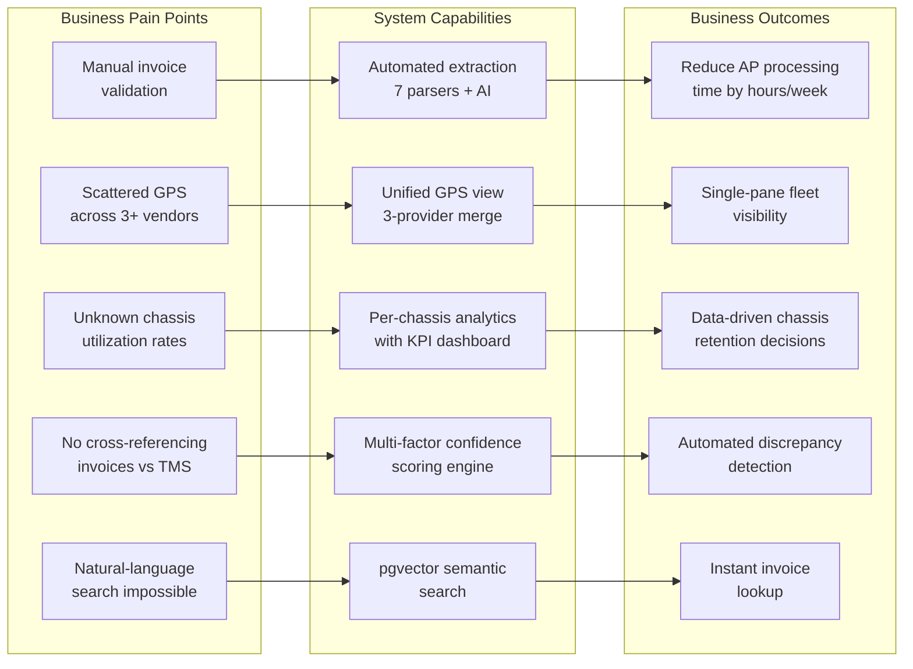

### 10.2 Module Maturity Assessment

| Module | Maturity | LOC | Business Value | Key Risk |
|---|---|---|---|---|
| **GPS Unification** | MVP | ~400 | High — fleet visibility | Only Anytrek has real GPS; Fleetlocate/Fleetview lack coords |
| **DCLI Invoice Extraction** | Production | 275 | High — largest vendor | XLSX 0.18.5 has known vulnerabilities |
| **AI Invoice Extraction** | Production | 427 | Medium — fallback parser | Depends on Lovable AI Gateway availability |
| **TMS Matching/Validation** | Production | 236 | **Highest** — core business logic | Complex scoring may need tuning per vendor |
| **Semantic Search** | MVP | ~200 | Medium — AP productivity | Embeddings only built for DCLI invoices currently |
| **BlackBerry Radar** | Production | 195+106 | High — IoT asset tracking | ES256 key management, no key rotation mechanism |
| **Utilization Analytics** | Production | 699 | High — chassis ROI insights | Double-count bug in `totalDays` (line 163) |
| **Geofencing** | Stub | ~100 | Low (currently) | Schema inconsistency, incomplete CRUD |

### 10.3 Critical Findings Summary

| # | Finding | Severity | Location |
|---|---|---|---|
| 1 | All 10 edge functions have `verify_jwt = false` | **CRITICAL** | `supabase/config.toml:3-30` |
| 2 | `xlsx@0.18.5` — npm-abandoned, known prototype pollution CVE | **HIGH** | `extract-dcli-invoice/index.ts:3` |
| 3 | CORS `Access-Control-Allow-Origin: "*"` on all edge functions | **HIGH** | Every edge function (e.g., `extract-dcli-invoice/index.ts:6`) |
| 4 | `utilizationPct` can exceed 100% due to overlapping load days | **MEDIUM** | `UtilizationTab.tsx:162-163,185` |
| 5 | Fleetlocate `speed` field maps to `Duration` column (misnamed) | **LOW** | `useFleetlocateData.ts:56` |
| 6 | Fleetview hardcodes all GPS fields to 0 | **LOW** | `useFleetviewData.ts:52-70` |
| 7 | `parseCharge` / `formatCurrency` duplicated across two components | **LOW** | `ChassisDetail.tsx` + `UtilizationTab.tsx` |
| 8 | Google Maps geocoding has no caching (cost risk) | **MEDIUM** | `supabase/functions/_shared/geocode.ts` |
| 9 | Hardcoded fallback invoice ID `"1030381"` | **LOW** | `extract-dcli-invoice/index.ts:62` |
| 10 | Notification badge hardcoded to 3 | **LOW** | `DashboardLayout.tsx:67` |

### 10.4 Recommended Priority Actions

1. **Security (Week 1):** Enable `verify_jwt = true` on all edge functions and implement proper RLS policies
2. **Security (Week 1):** Replace `xlsx@0.18.5` with `SheetJS CE` or `ExcelJS`
3. **Bug Fix (Week 2):** Fix `totalDays` double-counting in `UtilizationTab.tsx` — use the `utilizationMap` count instead of per-load summation
4. **Data Quality (Week 2):** Fix Fleetlocate speed/Duration mapping; investigate Fleetview GPS data availability
5. **Architecture (Week 3):** Extract shared utilities (`parseCharge`, `formatCurrency`, `safeParseDate`) into a common module
6. **Feature (Week 4):** Extend embedding pipeline to cover all vendors (not just DCLI)

---

*Report generated from direct source code analysis. All `file:line` references verified against the codebase at commit `3772273` on branch `claude/legacy-codebase-audit-9fnkT`.*
